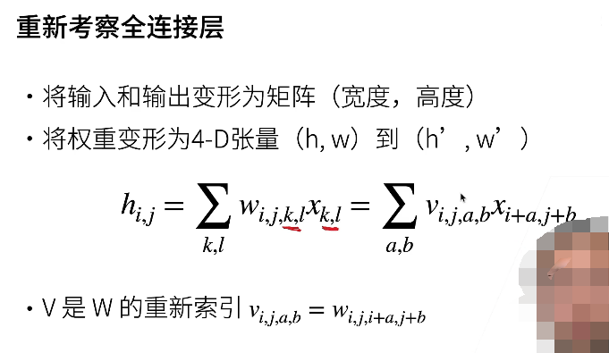
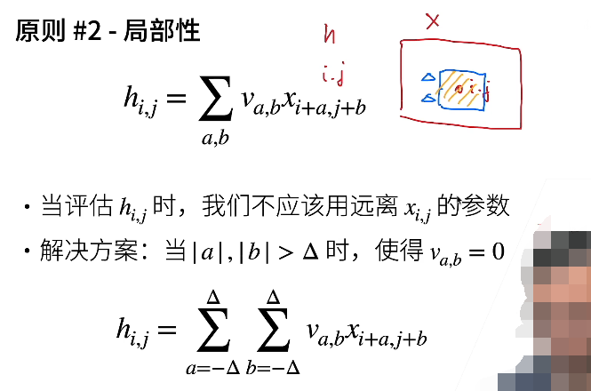
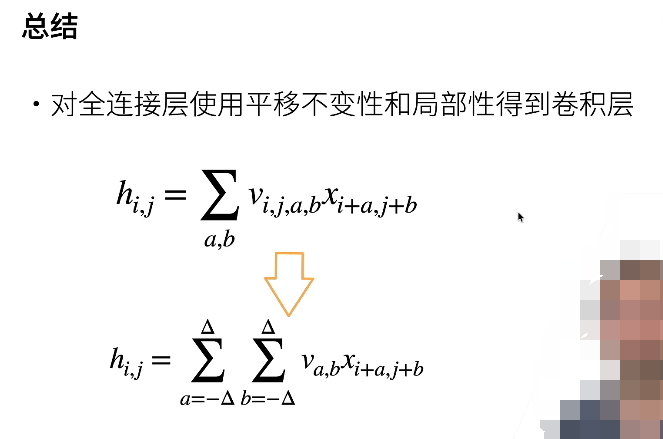

# 从全连接层到卷积层

X 是一个矩阵，在全连接层的时候，一张图片（黑白，单通道）被拉伸成了一个向量来表示，从而将其传输给全连接层，在这里，不仅要考虑图片的数据性，还要直接从公式，也就是数学的表达式的角度上体现出空间的特性，因为图片本就是二维的。

那么，因为图片是二维的数据，所以用矩阵 X 来表示图片。那么 k,l 也就锁定了图片的一个像素点。由于卷积层的输入在这里是二维的数据 X。那么输出也对应成二维的输出格式来表示，矩阵 h 用来表示卷积层的输出矩阵。但是，输入的长宽和输出的长宽是不一样的。权重参数 W（高维矩阵），在这个高维矩阵 W 中的每一个 i,j 所确定（k,l 可以任意取）的一个二维矩阵便抽象且记录了整个输入矩阵 X 在输出矩阵 h 的 i,j 这个像素点的影响。也就是说，一个由 i,j 所确定的二维矩阵 Wi,j 可以理解为是卷积层的一个神经元。

卷积层的每一个神经元只负责记录输入数据对输出数据的某一个像素点的影响和抽象化。

## 原则1 平移不变性

在上边的叙述中，它的本质依旧是一个全连接层，模型的复杂度依旧是非常的高，参数的数量依旧是非常的大，下边这段才是将模型的复杂度减少的过程。

通过转化为 a,b 表示后，如果中点位置 i,j 发生变化，那么，使用的参数矩阵也就发生了变化，但是不论以谁为中心，使用的识别的模式，都不应该发生变化，所以抹除了 V 的 i,j 两个维度。（二维卷积）

## 原则2 局部性

a,b 是以 i,j 为中心进行偏移扫描图像的。但是根据局部性来看，a,b 的范围不应该过大，也就是说矩阵  Va,b 不应该是一个过大的矩阵，如果 Va,b 是一个过大的矩阵，那么就相当于计算机以非常大的面积作为视野。而卷积的想法是，把计算机视觉的视野变小，只看局部。就像人类在一个庞然大物中也只能看到局部一样。 

## 总结

对全连接层使用 平移不变性 和 局部不变性 后 ==> 得到卷积层

