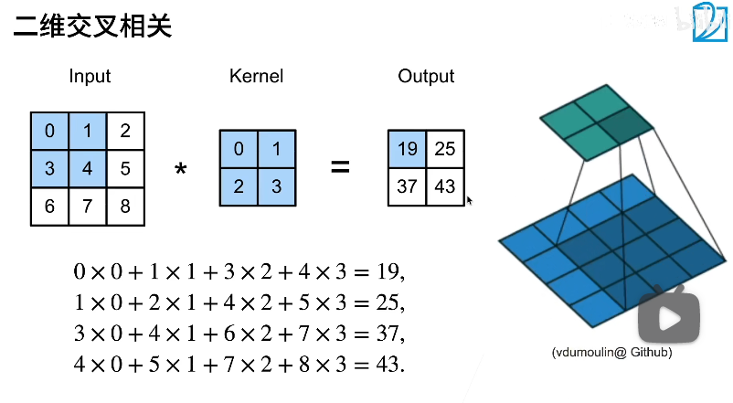
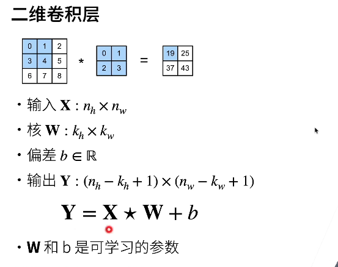
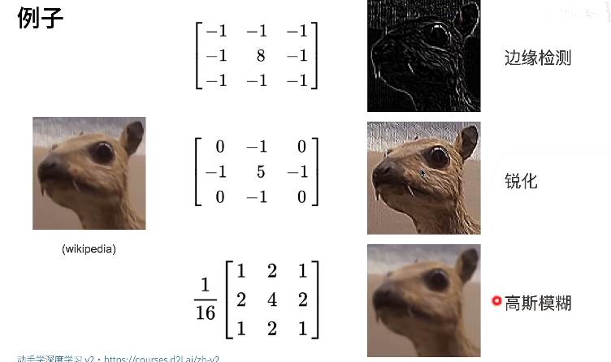
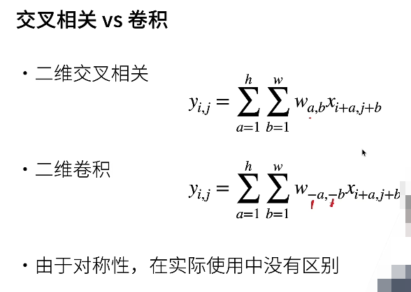
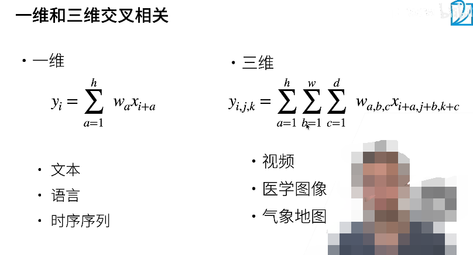
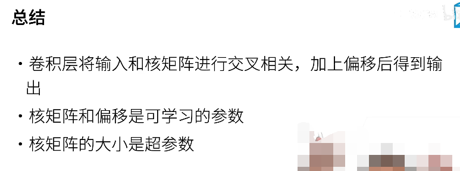

## 卷积层，二维卷积

当 kernel 在扫描整个图像的时候，似乎一个 kernel 矩阵的扫描过程使得它不能够被求导了。但是，它其实还是能够被求导的，可以这样来想：只不过是 kernel 这个参数被多次使用在多个位置参与函数的运算而已。那么，另外一个问题，似乎输入的图像矩阵也有类似的问题？但是，其实并没有问题，因为输入的图像矩阵只是一个常数而已，常熟是不影响求导的运算的。综上，自动微分不会产生问题。

这里的 kernel 就是上一节中的 Va,b

1. 平移不变性：输入的窗口在变化，但是 kernel 矩阵不变
2. 局部性：输入的数据的大小不论从长还是宽都是大于输出的矩阵大小的

扫描的规则：自上而下，自左向右 ==> 一行一行的子矩阵来扫描

- 输出：确定输入的大小，确定 kernel 的大小，那么也就确定了输出的大小，因为 kernel 要扫描整个输入的数据，所以确定了前两个也就确定了输出。
- 下图中的五角星是交叉操作：就是横扫的那个操作运算

## 不同卷积核的例子

1. 中心的值较大，其他的位置都是 -1，那么可以做出 边缘检测
2. 中心是 5，对角为 0，其他的位置是 -1，可以得到一个 锐化 的效果
3. 最后是高斯模糊的效果

可以理解为：神经网络可以学习出一些这样的核，然后得到相应的效果

## 交叉相关 vs 卷积

1. 二维交叉相关的 a,b 不带 负号，而二维卷积的 a,b 带了负号。但是，在实际使用中是没有任何区别的，因为只不过是索引到的 W 中的参数位置不同，但是学习到的值是一样的，对于两者的 W 矩阵，只要将其中一个进行上下且左右交换元素，那么就得到了另外一个的 W 矩阵。
2. 虽说是卷积层，但是实现的计算是交叉相关

## 不同维度的交叉相关运算

- 对于图像而言，二维的 kernel 是主流
- 还可以是多出来一个时间轴作为一个 kernel 的维度

## 总结

- 一个 kernel 有一个 bias （偏置项，一个单值 value）
- kernel 的大小是可以调整的超参数（与算法本身无关的）
- 找到一个核大小的超参数是一个很小的模型

