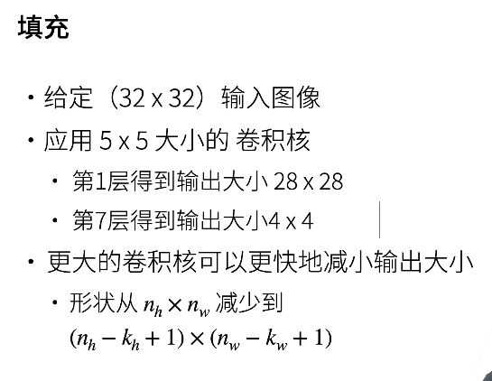
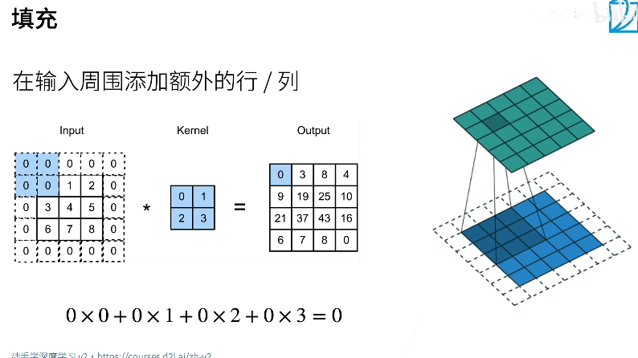
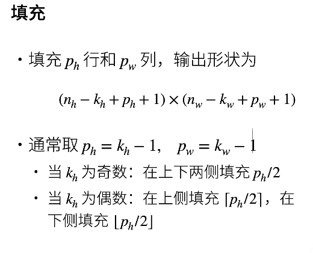
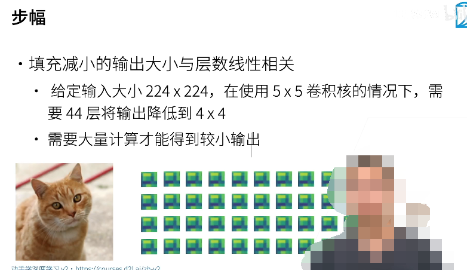
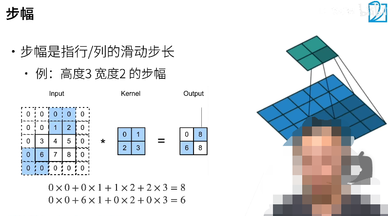
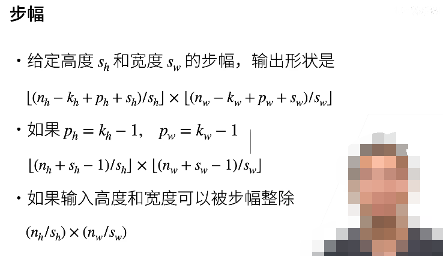

# Padding-and-Stride

## 引出的问题

- 卷积核越大，输出越小
- 如果连续用基层卷积核的话，那么会变得越来越小，这样就限制了层数的大小

## 解决方案

1. 填充
2. 步长

## 01 填充

P = padding = 填充

ph ==> 在高度上填充

pw ==> 在宽度上填充

使用如下的填充数值，可以使得输入和输出的大小相同

## 02 步幅

如果只使用较少的卷积核，最终希望得到一个较小的输出，那就需要非常多的卷积层才能够实现这一点，这会导致计算量非常大，解决方案是：步幅（Stride）

什么是步幅？

步幅：就是在移动窗口的时候，每次移动多个格子：

1. 宽度上的步幅
2. 高度上的步幅
3. 默认情况下，宽度上和高度上的步幅都为 1
4. 如果向一个方向移动的时候，但是如果按照所设定的步幅移动会产生越界，那么就不计算这一次的移动，直接忽略剩下的那些数据即可。
5. 一般情况下步幅取 2

## 总结：

填充和步幅都是卷积层的超参数，可调

1. kernel 的大小
2. 填充的大小，行和列两个方向上的填充
3. 步幅的大小：行和列两个方向上的步幅

