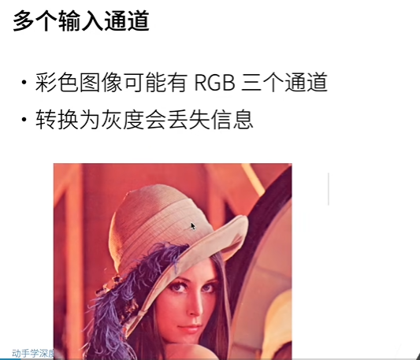
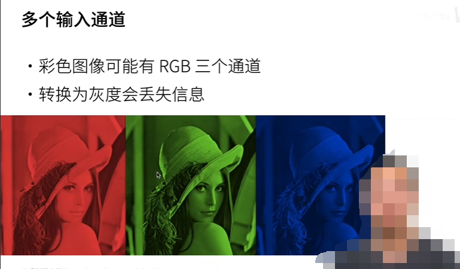
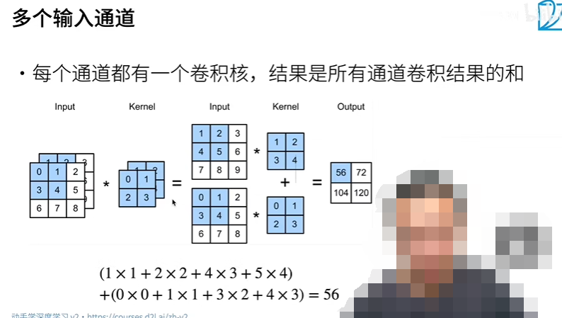
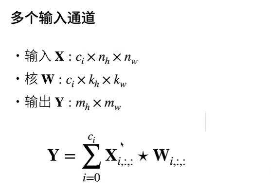
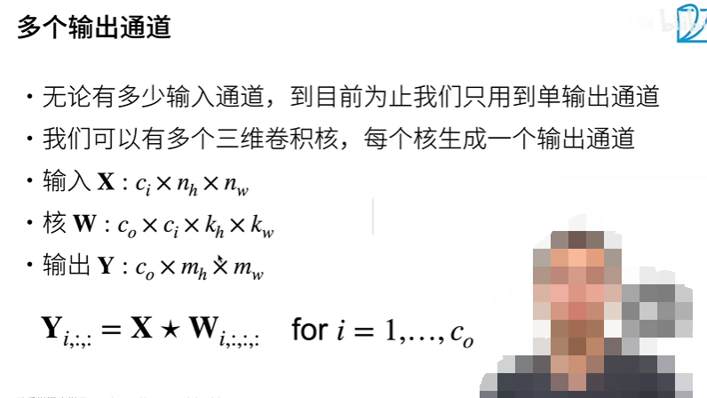
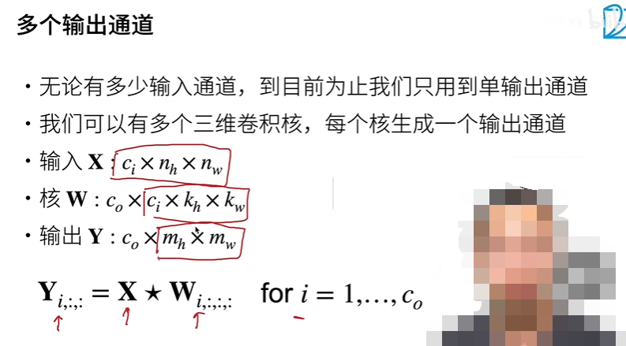
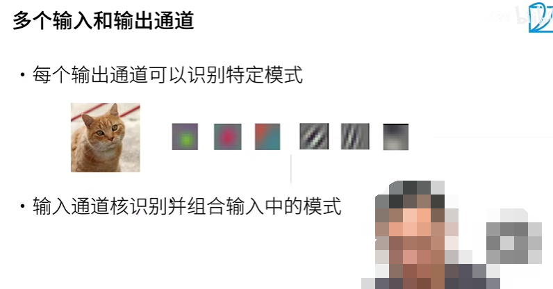
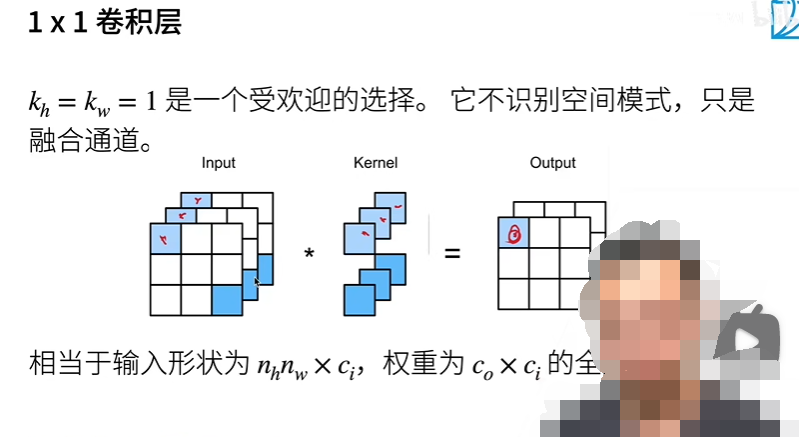
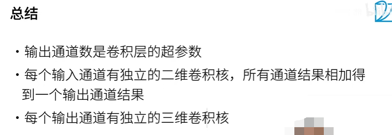

## Multiple-Input-Channels

1. 彩色图片有 RGB 三个通道
2. 转换为灰度会丢失信息

## 多个输入通道

如何做卷积，如何运算

1. 每个卷积核都有自己独立的参数，每个卷积核针对于一个通道
2. 最终的输出矩阵是：所有卷积核相应位置的值叠加在一起的值
3. 每个通道都是有自己的偏移的 bias 

公式表示

1. 其中 ci 是指通道的个数

## 多个输出通道

1. 对于 RGB （3 通道）的输入而言，每个输出通道都是由 3 个卷积核分别对 RGB 运算后得到的结果，若输出通道为 6，那么下一层的卷积网络的输入通道就为 3，则下一层的每个输出通道就都是由 6 个卷积核分别对 6 个输入通道进行运算后加和在一起得到的结果。
2. 输入通道为 Ci 输出通道为 Co，那么在这一层卷积的过程中就需要 Ci 乘以 Co 个卷积核，其中每 Ci 个卷积核为一组产生一个输出通道。
3. Ci = channel input 
4. Co = channel output
5. 越深的卷积层是在识别更加精细的局部，然后对它进行加和，组合成一个完整的猫。

## 特殊的卷积层

1. 不识别空间信息，没有空间模式
2. 但是，融合不同的通道的信息
3. 其实，输出通道的高宽等于输入通道的高宽，并且输出通道的对应位置的值是输入通道对应位置的值的加权和
4. 其中，3 个 kernel 为一组，产生一个输出通道，因为共有两组 kernel 所以产生了两个输出通道 output
5. 相当于输入形状为 Nh * Nw * Ci，权重为 Co * Ci 的全连接层

## 二维卷积层

以上所阐述的内容就是二维卷积层，指的是输入的数据的每个通道是二维数据

1. X 是 3-D 的输入：X 是一张图片，有三个通道
2. W 是 4-D 的权重：第 4 个维度是用来确定输出的通道个数的
3. B 是每个卷积核的偏置项

## 总结

1. 输入并不是卷积层的超参数，输入的通道数取决于前几层的输出，或者数据本身

