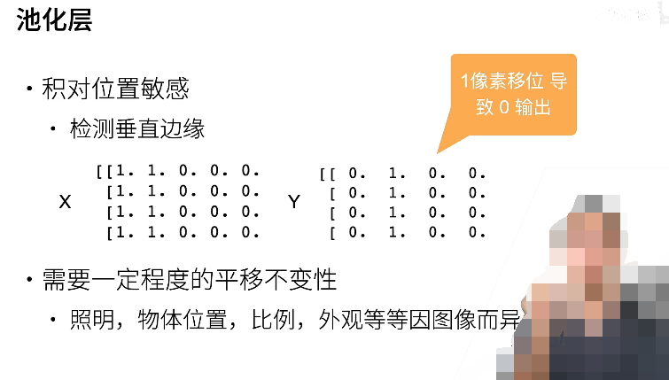
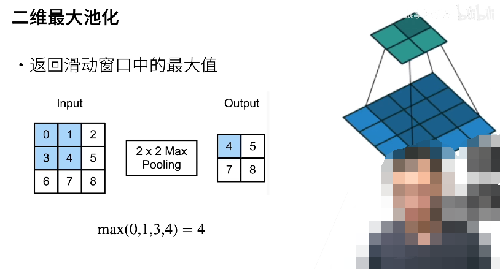
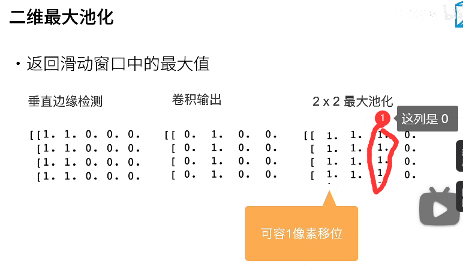
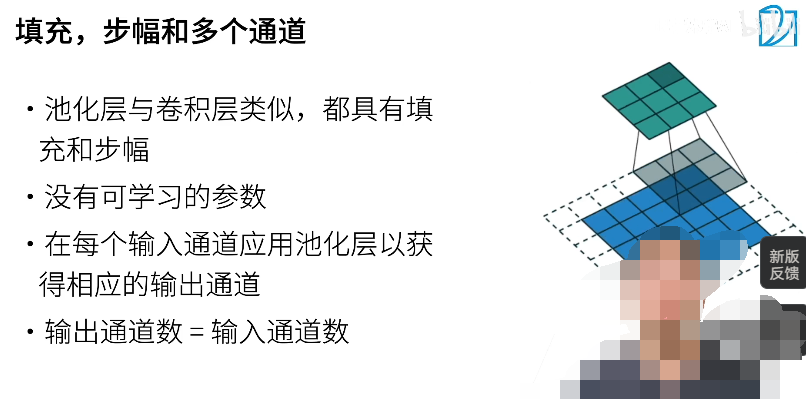
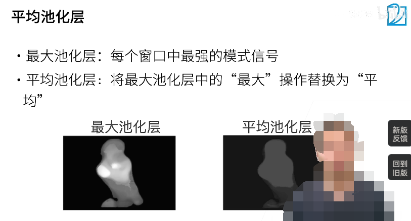
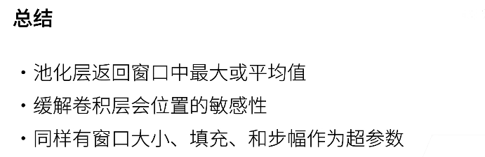

## Pooling Layer

对于垂直边缘的检测：

如果在拍照的时候，物体动了一下，或者手抖动了一下，那么边缘都会产生一些变化。

卷积层对于位置太敏感，不是特别好的事情，所以需要一个池化层

## 二维最大池化

池化窗口并不是核，而池化窗口只是代表了一个尺寸，并不含有参数，它只是把窗口中的最大值给拿出来

那么最大池化层，能不能解决像素偏移的问题呢：

在卷积输出上再进行一次二维最大池化输出，可以容忍一个像素点的便宜，在对垂直边缘检测的时候，只是检测了左右两个值是否产生了变化，而并不是必须要这一列到旁边一列全部产生变化才算偏移。

因此，使用池化层对输出进行一次操作，可以容忍一个单位的像素点的偏移

## 池化层的超参数

## 平均池化层

1. 最大池化层是把其中信号最强的那个给输出出来
2. 平均池化层是把平均的信号强度给输出出来，有一点抹平的成分，柔和化的效果

## 总结

