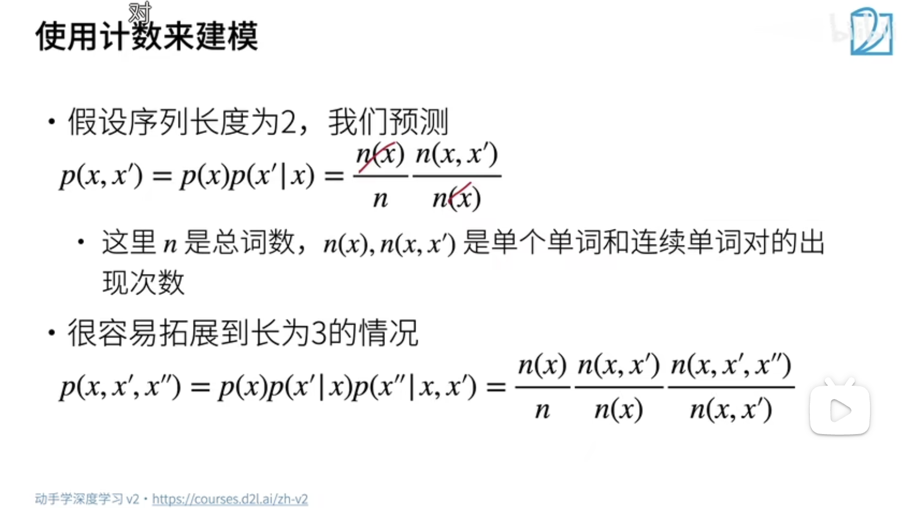
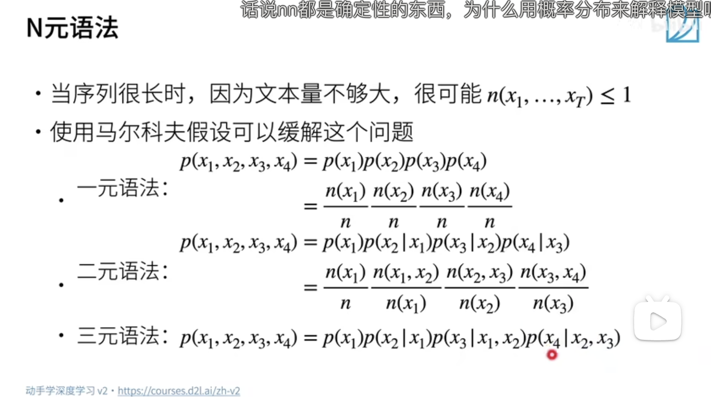

## 语言模型和数据集

语言模型的使用方面：

1. 做预训练模型（eg BERT, GPT-3）
2. 生成文本，给定前面几个词，不断使用 $x_{t} 对于 P(x_{t-1}, x_{t-2}, ..., x_{x1})$
3. 判断多个序列中哪个更常见，比如有几个句子，判断哪个句子出现的概率更大

$n(x, x^{'})$ 代表：在 $x$ 后边出现一个 $x^{'}$ 的次数，这个值除以 $n(x)$ 就是在给定一个 $x$ 的情况下出现 $x^{'}$ 的概率，就成为了条件概率 

使用计数建模，就是扫描一遍文本，看看后边出现什么值的概率最大。

## N 元语法

N 元语法 => 等价于向前看 $n-1$ 个值，但是序列的长度为 $n$ ，算上当前这个元素

## 总结

