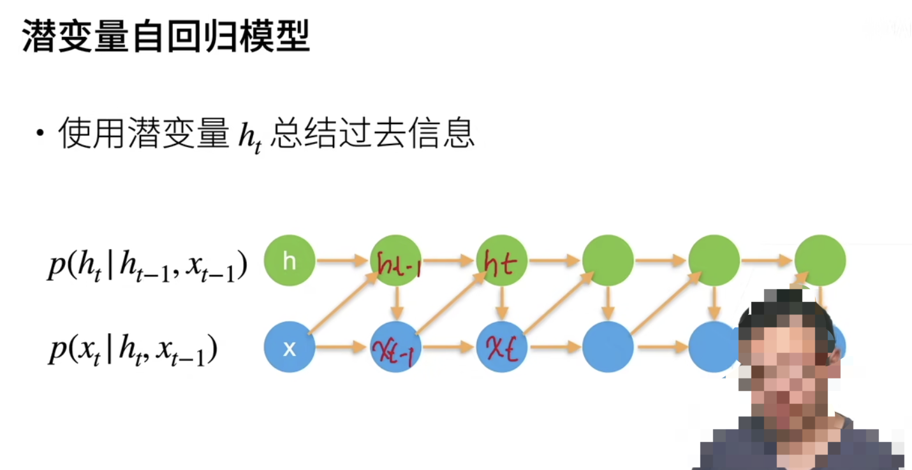
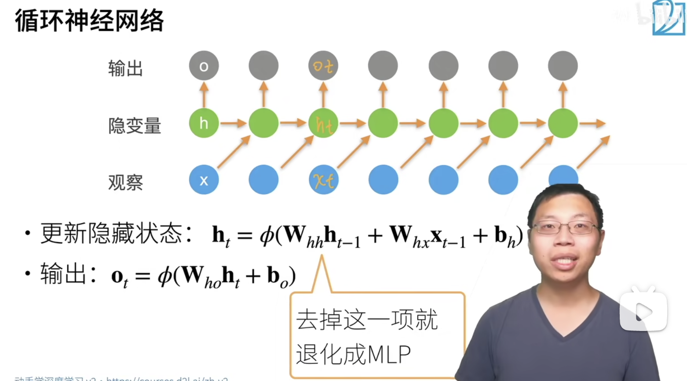
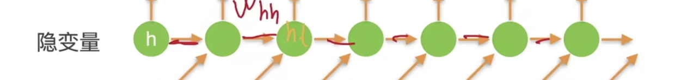
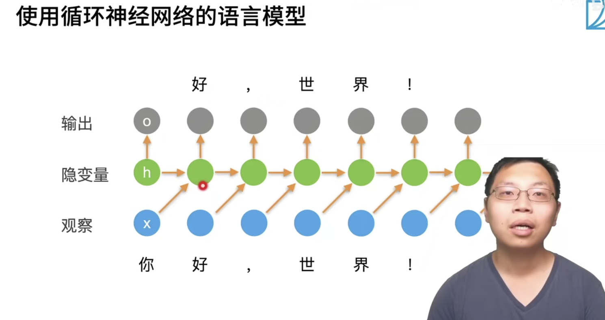
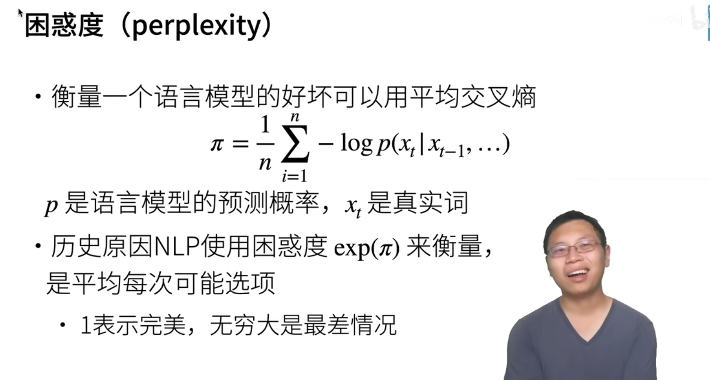
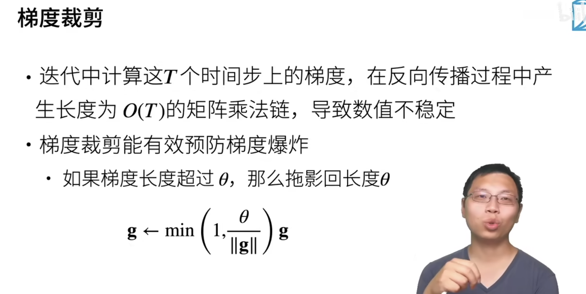
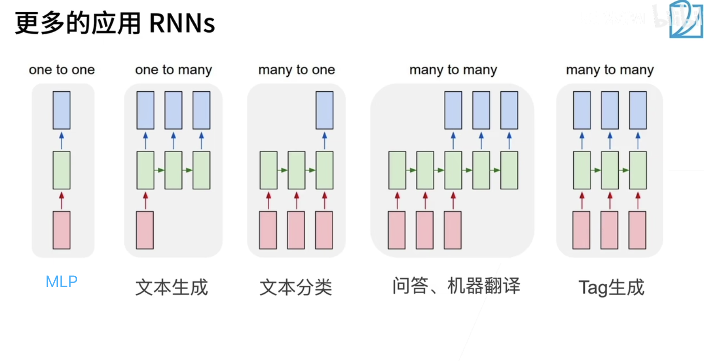
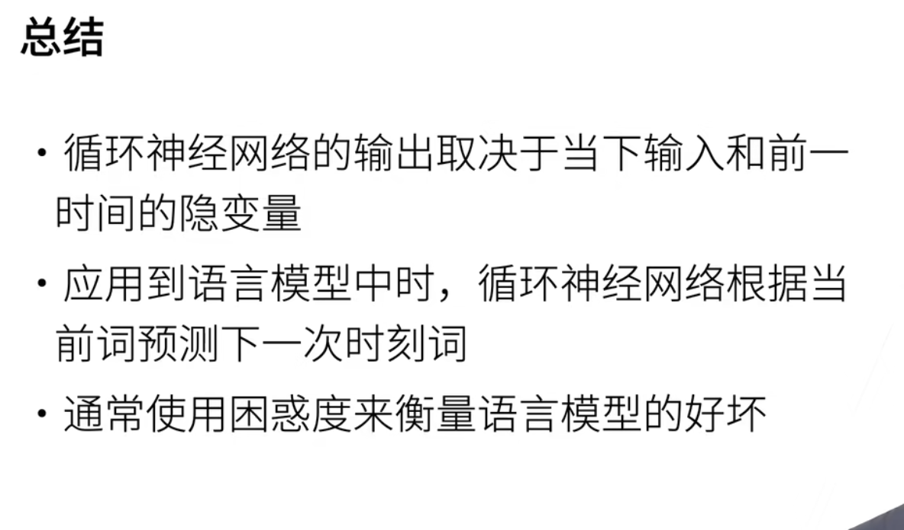

## 卷积神经网络 RNN

上下是按照时间关系对应的，然而 $h_t$ 和 $o_t$ 的值只能使用 $x_t$ 之前的那些

使用 $x_t$ 之前的数据预测得到 $o_t$ 但是在计算损失的时候比较的是 $o_t$ 和 $x_t$ 之间的差异，就是看一下使用之前的数据预测下一个时刻发生的事情是不是预测对了。与多层感知机（MLP）不一样的地方在于有了一个时间轴的概念。

在这里包裹起来这些运算的 φ 是一个激活函数

在 $W_{hh}$ 里存储了时序信息

## 怎么用

## 困惑度 衡量语言模型好坏

## 梯度剪裁

预防梯度爆炸，这种梯度剪裁方法来控制梯度向量的长度

## 更多 RNN 的应用

## 总结

