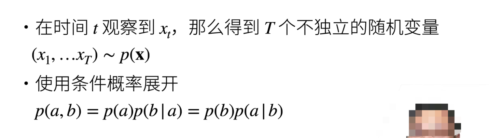
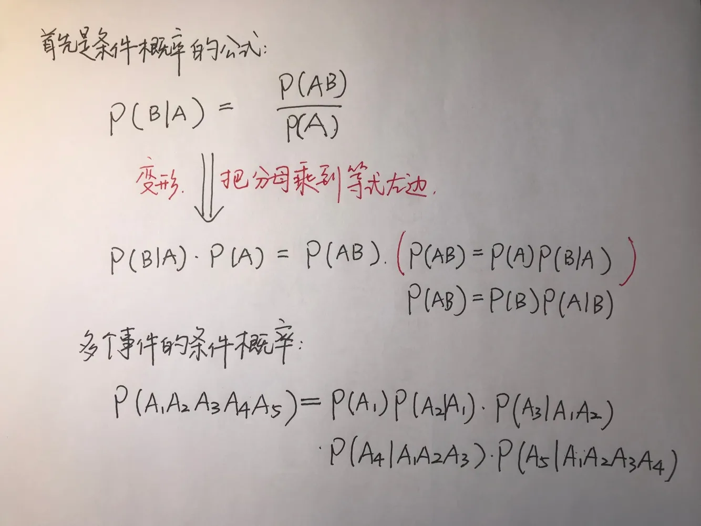
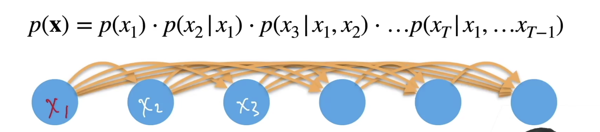
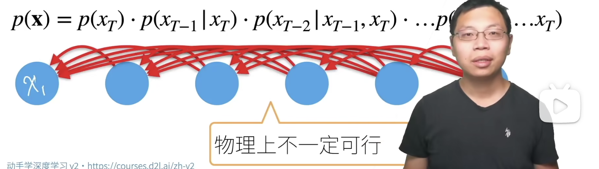
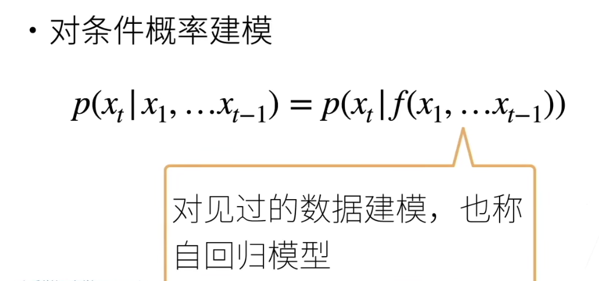
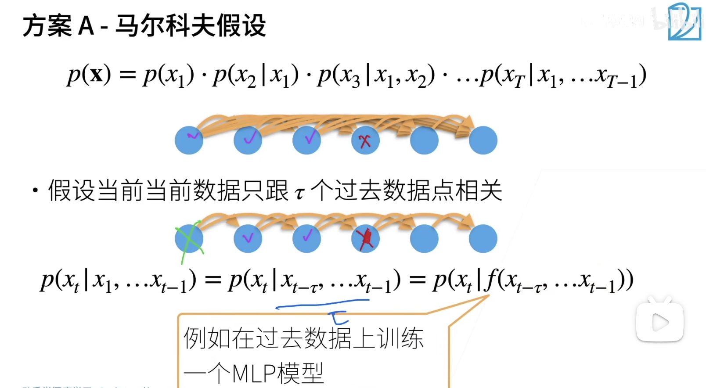

## 序列模型

$ P(a, b) $ 是指 a 和 b 同时发生的概率

$ P(a | b) $ 是指在 b 发生的条件下 a 发生的概率

### 全概率公式的由来

$ p(x) $ 表示这个序列发生的概率

箭头指向 $ x2$ 表明 $ x2 $ 依赖于 $ x1 $  

 还可以倒着来，但是在物理上不一定可行，就是 Xt 是依赖于前者的：

## 自回归模型

给定一些数据，预测 当前数据的时候，使用的是当前这个数据前边的那些数据，所以自回归就是自己回归。其中的 $ f $ 可以理解为一个机器学习的模型，就是给定当前数据的前边的那些数据所训练的模型，然后用这些数据训练出来的模型预测当前的数据。

## 方案 A 马尔科夫假设

假设当前数据只和 $ τ $ 个过去的数据相关，如果和过去的所有数据都相关的话，那么计算的复杂度会非常大

