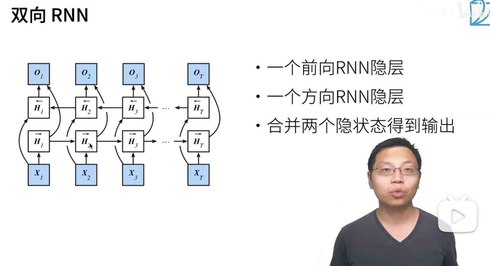
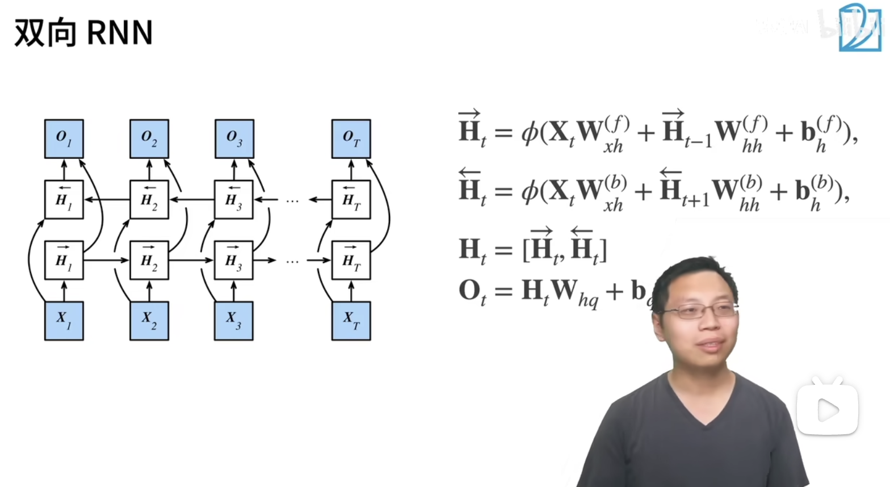

## 双向循环神经网络

从上向下数，位于第 3 层的是前向 RNN，就是上一个时间步的状态是更新给下一次的时间步的状态使用的。

位于第 2 层的是反向 RNN，而反向 RNN 正好相反，下一次的时间步状态给上一次的时间步状态来使用。

在实现的过程是简单的，如果把输入序列翻转一下的话那就相当于先看到了后边的值才看到了前边的值，这样就非常简单的实现了反向的 RNN 神经网络训练，在这个反向的神经网络输出的时候再把输出的序列翻转一下就可以啦！ 

公式写法：

