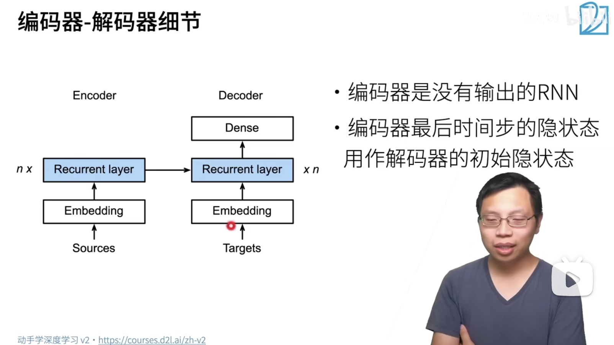

## 序列到序列学习

## seq2seq

双向 LSTM 可以作为 `Encoder` 来使用

可以使用 RNN 作为 `Decoder` 来使用

## 一些细节

`Encoder` 没有输出，而 `Decoder` 把 `Encoder` 中的状态直接作为了 `Decoder` 的输入

## 输入

Encoder: 可以使用双向 RNN 对需要翻译的句子进行编码（特征提取）

Decoder: 使用经过Encoder编码后的 **隐状态** 作为 Decoder 的隐状态，并且使用 **\<bos\>** 作为 Decoder 的样本输入。

Encoder 的输出其实就是 RNN 层的输出，等价于 隐状态，因为在这里只是使用到了 RNN 隐藏层，并没有使用线性层进行压缩并输出。

1. 使用 **\<bos\>** 作为 X 输入到 Decoder 并 使用 Encoder 的输出作为 Encoder 的隐状态。
2. 这时候，Encoder 产生了第一个输出 **bonjour**，并且由于 **\<bos\>** 的输入导致 **隐状态** 的信息有一次得到了叠加。
3. 这时候把 Encoder 当做一个循环神经网络模型来使用，把上一次产出的隐状态和模型输出分别作为下一次的隐状态输入和模型输入。

## 细节

编码器 Encoder 的输出就是 RNN 层的输出，并没有经过任何处理。

因此编码器 Encoder 的最后一个时刻产生的隐状态和 Encoder 的最后一层的 RNN 输出就是同一个东西。

所以说，编码器 Encoder 不需要那个全连接层。

## 训练

在训练过程中，Decoder 循环输入输出的过程中，如果 Decoder 对于一个时刻的翻译出错了，那么在下一次的输入中要使用正确的内容作为输入。

因为在训练的时候是知道对应的正确的值应该是什么的。所以没必要使用错误的内容作为下一轮的 Decoder 的输入了。

## 衡量生成序列的好坏

## 总结

