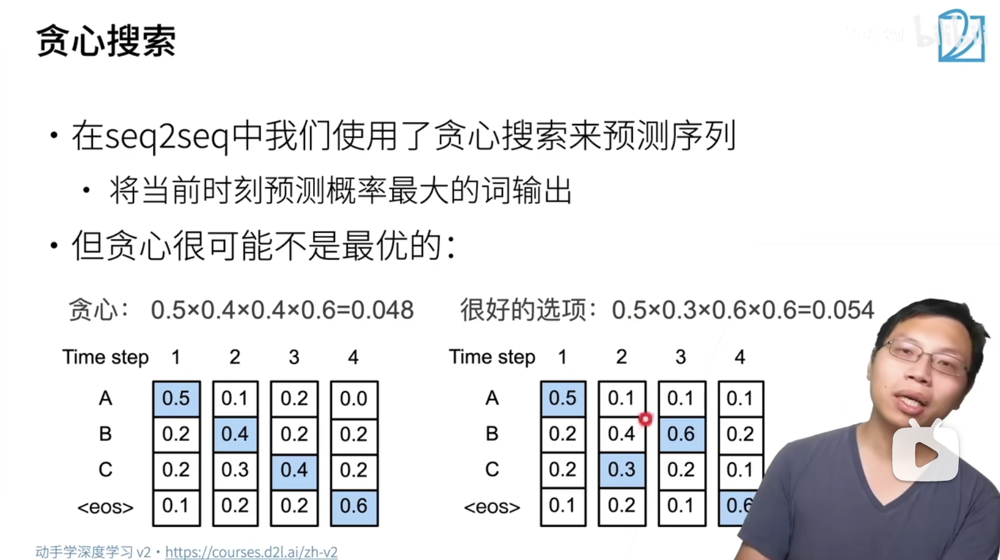
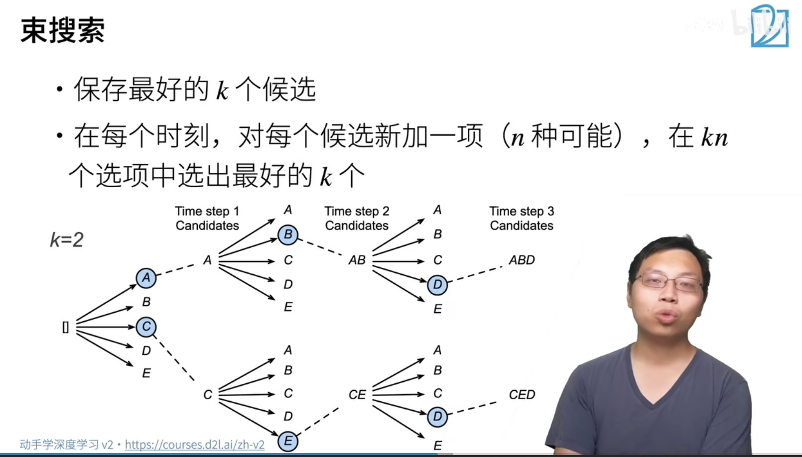
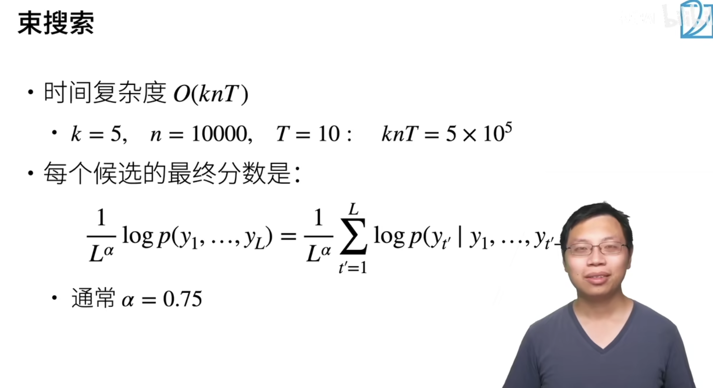

Beam Search 束搜索

相对于束搜索而言就是穷举法了

贪心算法：若按照贪心策略来计算的话，每次选择当前的最优知道结束

但是如果每次选择的可能不是最优的，却可以使得最终得出的结果从整体来看是一个最优的序列。

束搜索：使用穷举的方法计算量太大难以实现。每次选择k个最优的方向然后发散下去进行搜索就是束搜索的策略了。

## Beam Search

选择概率最高的$k$个，这里的 $k=2$

## 时间复杂度

在计算得分的方法上，对于得分如果句子越长的话，那么一个子句子的得分肯定是较高的，因为概率都是小于1 的，越乘越小，这样就会倾向于选择较短的句子了。

因此通过下边的方法进行评分，给长句子一些好处，抵消一些长句子带来的得分低的情况。有点像计算 $BLUE$ 的计算思想。

