注意力提示

## 心理学启发

1. 不随意线索：不随着自己的主观意识去发出的动作。不需要随着自己的思考发出的动作往往都是捕捉到比较特殊的点，比较亮的地方。
2. 随意线索：随着自己的主观意识发出的动作。随着主观意识去观察的东西都带有一定的刻意性。

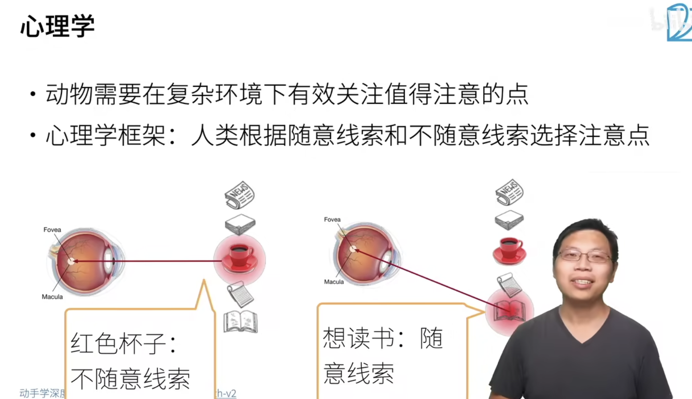

## 思考

卷积层、池化层：这些往往都是把最亮的那个东西给提取出来，比如每次都从中取最大的值，这就是 **不随意线索**，最大的值就代表了最亮的东西。

## 注意力机制

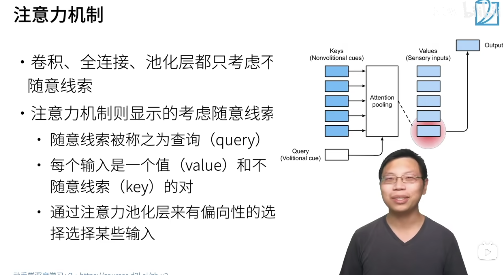

1. 注意力机制是意图在寻找随意线索，希望让模型带有刻意性。为完成一个特定的目的而生成特定的模型。
2. 随意线索称之为 **查询**（query），查询自己的大脑，问自己想要去做什么。
3. 输入是以 **key** and **value** 来呈现的，有一个事物在那里可以是 **key**，然后这个 **key** 对所训练的模型所达到的目的有多强（自己想去干什么）就是对应的 **value**。这样就变成了从 **key** 到 **value** 的查询了。
4. 从而通过注意力池化层来 **有偏向** 的选择某些输入。成对的 key value 对，key value pair。

## 非参注意力池化层

1. 非参：不用学习参数，只需要给定数据对 $ (x_i, y_i) $  就可以给出结果，其中 $ x_i $ 是 $ key $ 而 $ y_i $ 是对应的 $ value $
2. 平均池化层：不管给定的 $ x $ 是什么，每次都返回所有数据的平均值
3. 对于更好地方案：其中 $ K $ 是一个核，$ K(x-x_i) $ 像是衡量了 $x$ 和 $x_i$ 之间的距离，让它们减一下，再让分子除以下边的分母，这样就变成了一个概率，计算出来的每一项概率再用 $y_i$ 对它加权

使用平均池化层，不考虑距离的影响，直接对所有的 $y_{i}$ 取平均值。这样得到的结果没有考虑每个 $y_{i}$ 对于要查询的 $x$ 的重要性。通过加权的方式，可以把每个 $y_{i}$ 的重要性考虑在内。

重要性的衡量方法通过定义 $K$ 函数来具体实现。

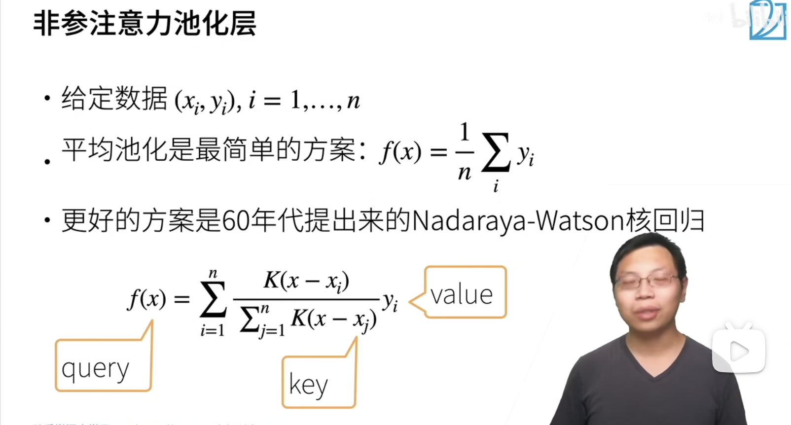

## Nadaraya-Watson 核回归

其中一种函数 $K$ 的定义

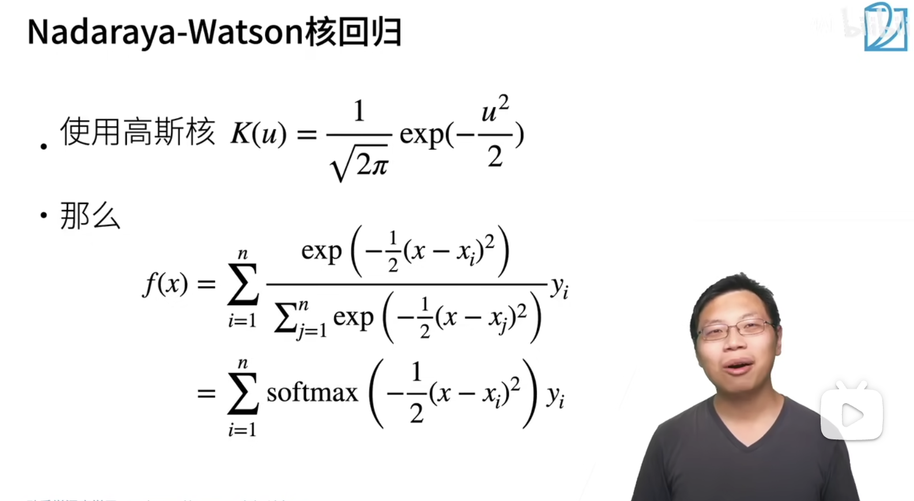

## 函数 K - 核的选择

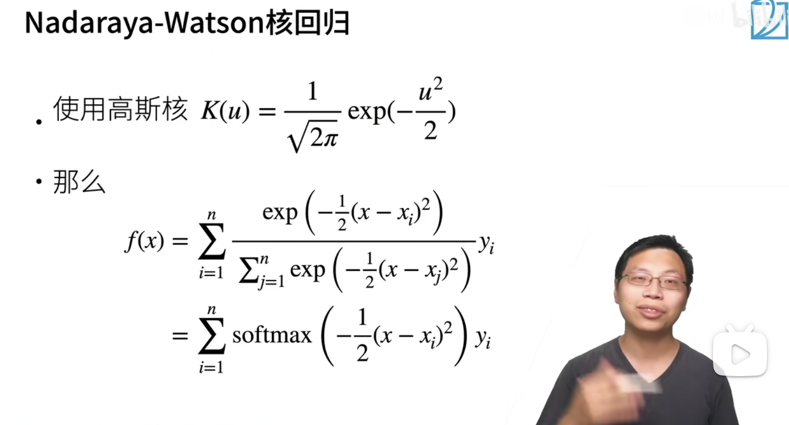

$f(x)$ 的实现就相当于是把每一个输出进行了归一化，最终输出一个概率分布。在计算的意义层面来看，也就是相当于做了一个 $softmax$ 处理。

这种方法不需要学习参数（权重 weights），是非参数的。

## 参数化的注意力机制

加入可以被训练和学习的权重 $w$ 就叫做参数化的注意力机制了，在这里的 $w$ 是一个 **标量**，也可以拓展到多维，让 w 变成一个向量，使用内积代替乘法。

引入参数 **w**，参数化的注意力机制。

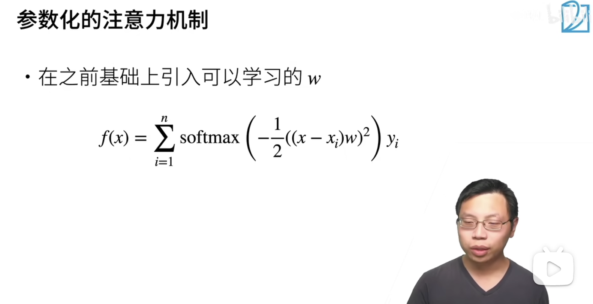

## 总结

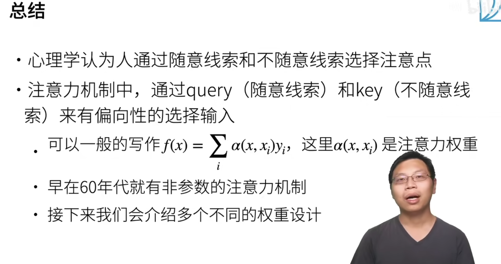

## 代码实现中的思考

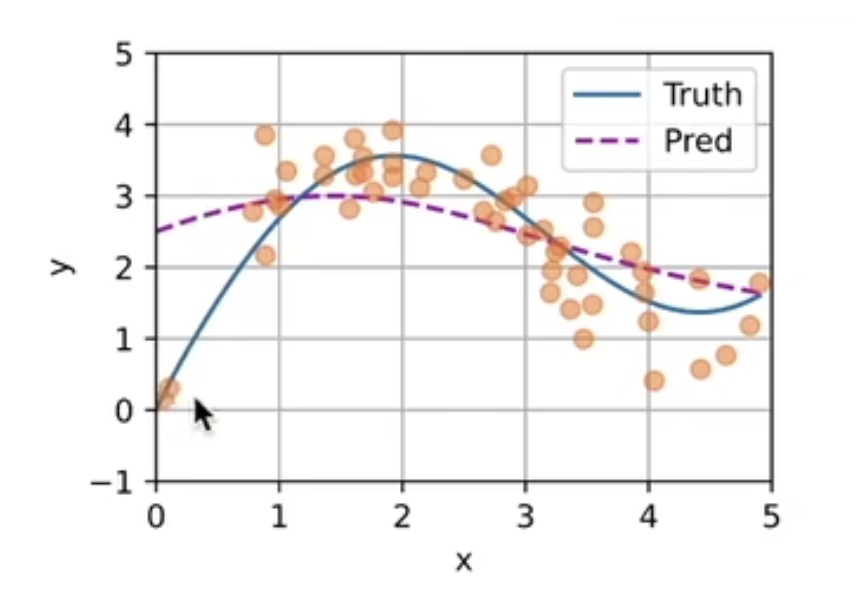

1. 黄色的点是带有噪音的样本点
2. 蓝色的线是真实的取值
3. 红色的虚线是通过注意力机制作用后产生的输出连接在一起的虚线。

如果直接对所有的点的 $y_{i}$ 取一个平均值的话，这样就得到了一条直线，但是这条水平的直线没有任何趋势。

如果使用注意力机制的话，由于有加权的存在，所以它在某一个点取到的值会将注意力集中在要查询的 $x$ 横坐标周围的那些黄色样本点的值。更多的取值是来自己附近的黄色样本点的取值的加权，而剩余的那部分的取值是来自距离查询的 $x$ 比较远的那些黄色样本点的 $y_{i}$ 加权后的取值。

带来的问题：

非参数化的注意力机制不需要学习参数，这样会产生一个比较平滑的虚线，但是这个虚线过于平滑了。（给定足够的数据，可以把这个曲线给整出来，但是现实生活中没有那么多的数据）

若引入参数，或许可以通过学习参数，来起到更好的效果。

## 注意力权重的分布

这个权重分布图像，就是把权重矩阵的每个值按照数值的大小换算成颜色的深浅画成了图像。

因为权重矩阵的第 i 行是预测第 i 个样本位置的值 y_hat_i 的时候所使用的分给所有样本的权重向量。

因此就有了下边的这张图了。

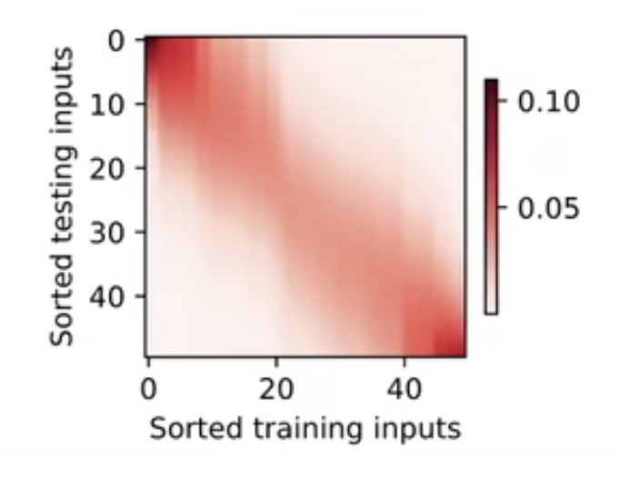

1. 行：第 i 行是对于查询 $x = x_{i}$ 的时候给每个样本分的权重
2. 列：第 j 列代表分给第 j 个样本的权重

$map[i][j]$ 就是预测 $x=x_{i}$的时候分第 j 号样本的权重

颜色越深代表分给它的权重越大

窗口该怎么看？

横着看每一行上红色所占的范围的宽度就是窗口。

如果每一行上红色的范围越大且颜色相对均匀，说明权重分的量越均匀

如果每一行上红色的范围相对较小且颜色较深，说明权重都集中分给了要查询的 $x$ 周围的那些样本点进行加权。

## 引入可学习参数

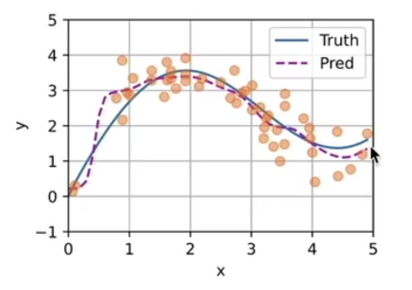

引入可学习参数后，窗口变得较少，权重都基本上集中给了周围的样本点进行加权

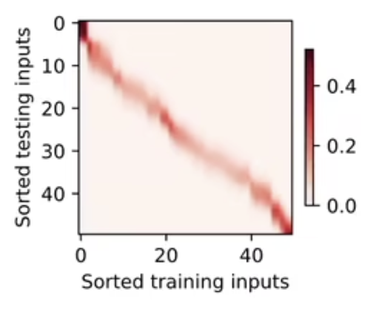

代码还没写！

