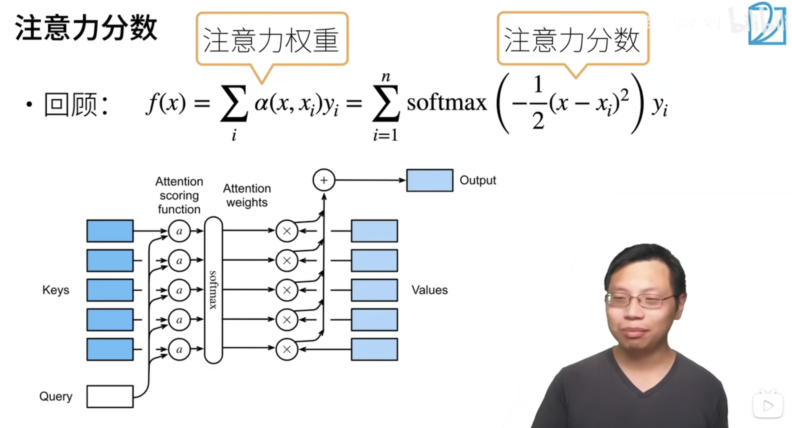

## 注意力分数

注意力分数：代表了 query 和 keys 的相似度。query 和哪一个 key 相似程度越高，那么对这个 key 对应的 value 的加权就越大。

尽管 key 是一个标量，但是 query 可以是一个向量。

看上去很奇怪，但是就是一个黑盒子，评价了一个向量 query 和标量 key 的相似度。

从低维，扩展到高维。

key 和 value 也可以是向量 ：）