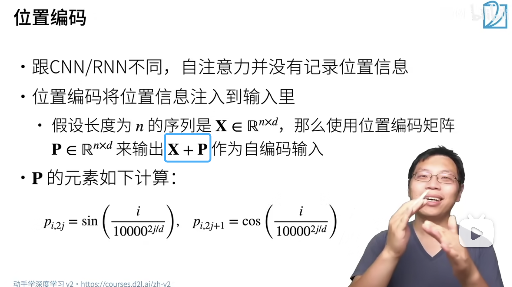
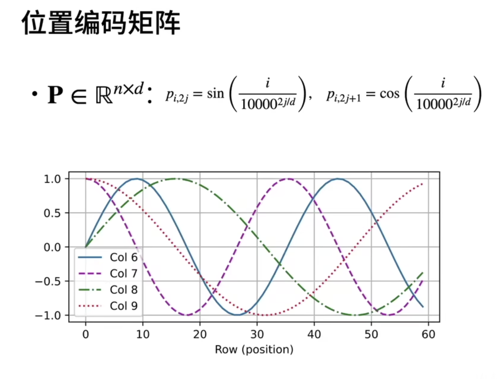
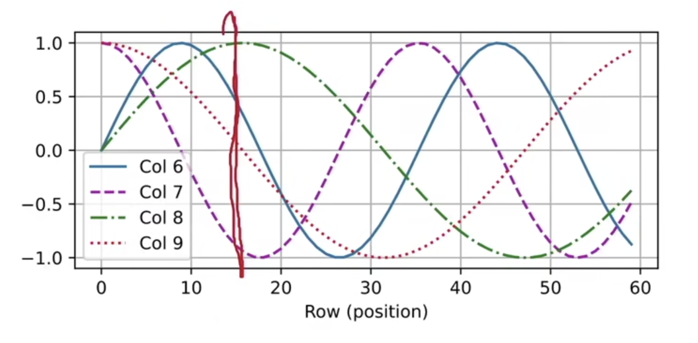
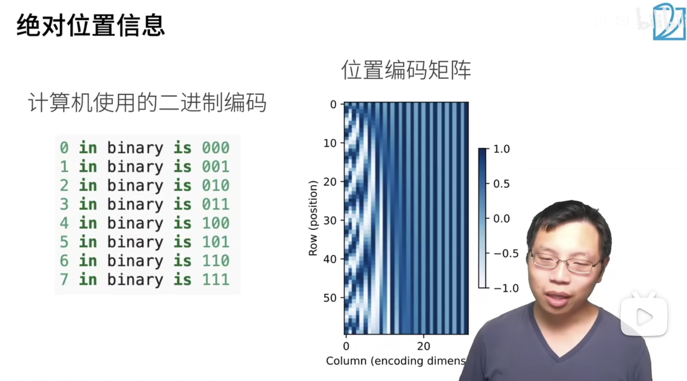
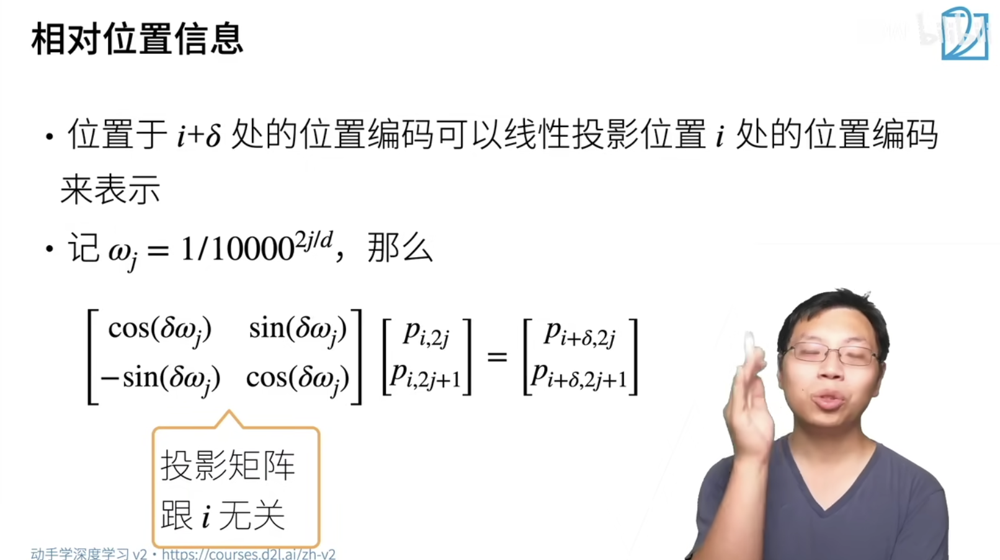

## 位置编码

最重要的就是要生成这个矩阵 P

一个矩阵 X 是一个序列，X 的每一行是序列中的一个值对应的向量化表示

1. 奇数列是一个 cos 函数
2. 偶数列是一个 sin 函数
3. 不同的列对应的 函数周期 是不同的
4. 总体来看，函数的周期被拉大了

横坐标代表的是行

第 i 行中对应的第 j 列采用的值是曲线 $col j$ 对应的函数值

每一列对应一个三角函数，而每一列的不同行采用的值取自这个函数不同位置的函数值

note:不用在意不同位置加上的位置编码的值的大小，而是应该在意在这一列上加上的函数值的变化速度。变化速度越快的则应该想象成二进制中越靠右的数值（权重小的数值），变化速度越快的应该想象成二进制中越靠左的数值（权重大的数值）。权重越高的那些位置的值周期越大（变化速度慢），权重越小的那些位置的值周期越小，（变化速度快）

这是加在一个行上的

更形象的来看：

在左边的值对应的权重较小，而右边的值对应的权重较大。可以发现，加在每一行上的都是一个位置信息，而左侧的这一列使用了同样的一个三角函数来表示，并且越靠左的这个三角函数的值变化的周期应该越小，这样才能体现出这个位置的权重小。

因此，摒弃曾经满k进1的想法。而是变成了通过变化的周期来确定一个位置的权重大小，从而形成了一个特殊的位置编码。

note: 以下的每一行抽象成 三角函数 的话，每一行中不同列对应的值来自不同周期的三角函数，也就是上述所示使用一条红线与不同周期三角函数交点处的函数值填充在对应的位置而形成的一个向量。

$[0,0,0,0,0]$

$[1,0,0,0,0]$

$[0,1,0,0,0]$

$[1,1,0,0,0]$

$[0,0,1,0,0]$

这张图展示了位置矩阵在 三角函数的值域 范围内的变化情况

位置矩阵的每一行都是一个编码，可以看到越靠左的这些权重较低的位置编码变化的速度较快，因为对应的三角函数的周期小。

二进制编码是绝对位置信息

用三角函数生成的是相对位置信息

可以把第 i 号位置向量投影到第 i+sigma 处

等价于，知道位置 i 的投影向量就可以计算出相对于位置 i 便宜 sigma 个位置的投影向量是什么

投影矩阵建立了这两个位置向量的变换桥梁 

