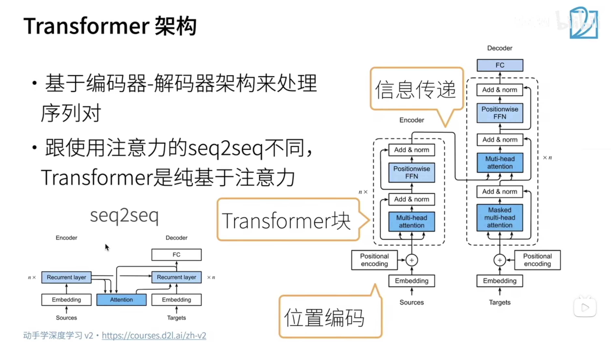
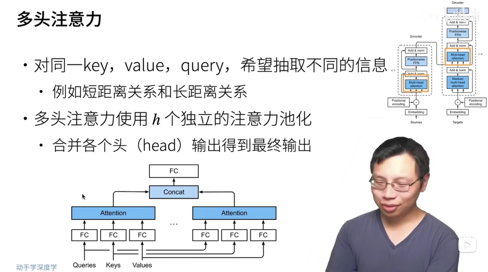
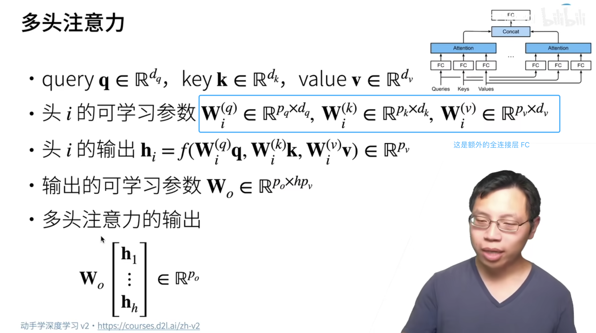
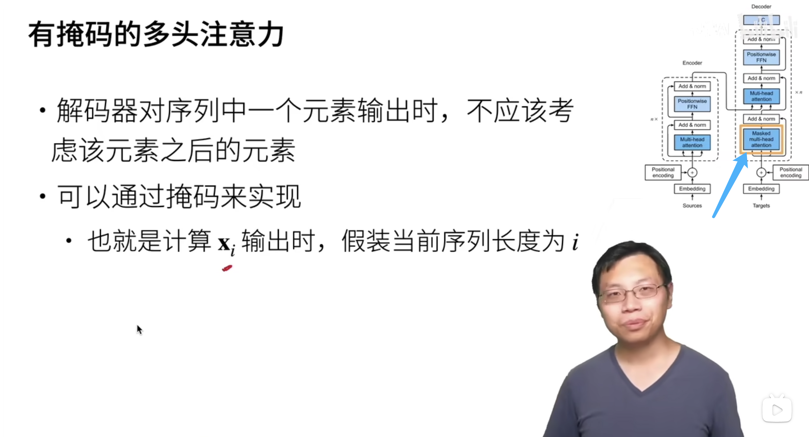
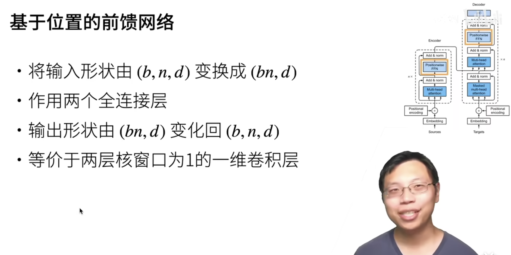
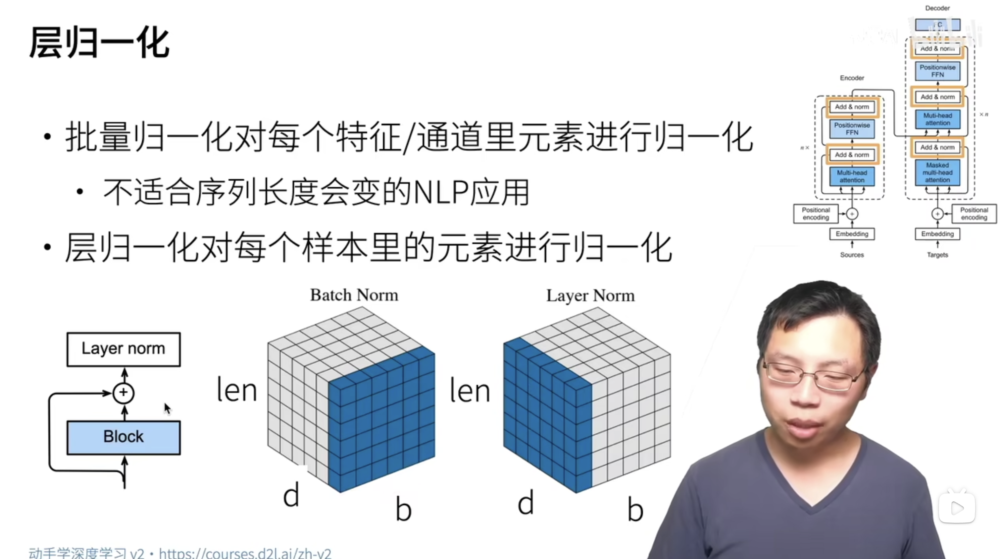
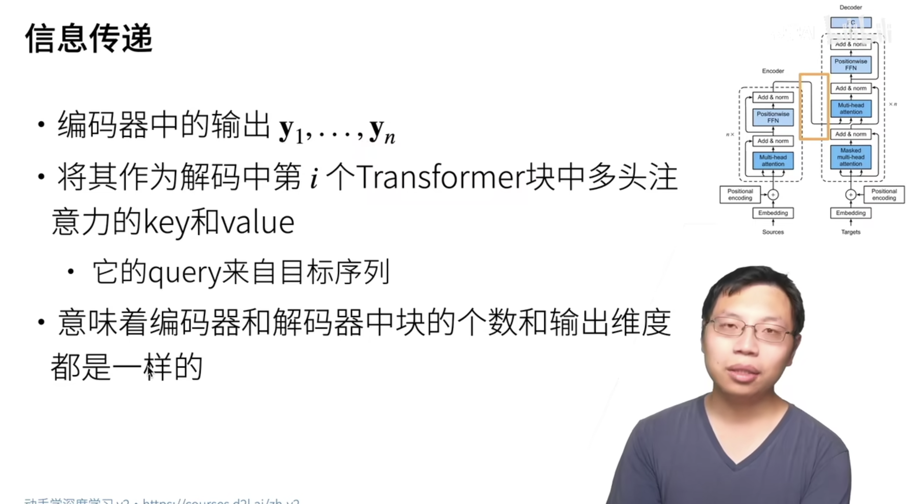
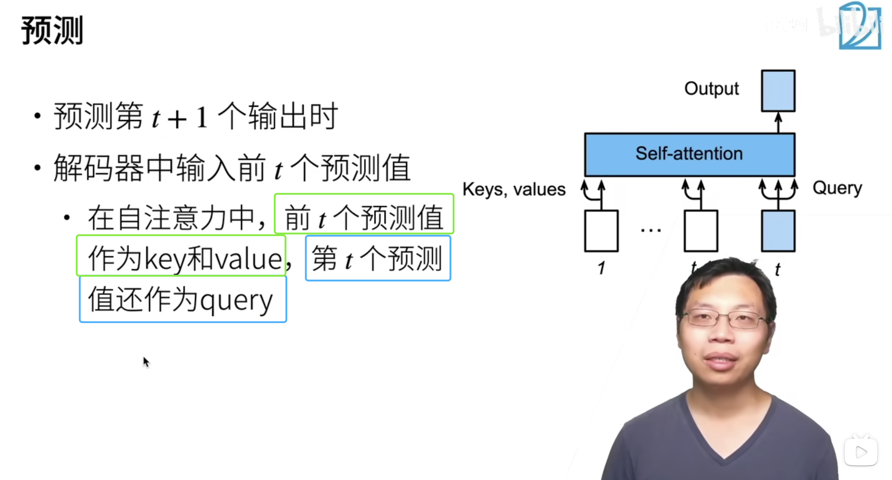

## Transformer

## Multi-Head-Self-Attention

数学表达：

## 带有掩码的多头注意力机制

 因为注意力机制可以看到全局的内容

在编码的时候是没有问题的，但是在解码的时候是存在问题的

解码的时候不应该能看到之后的信息，例如，在翻译的时候，还没有翻译出来的部分是看不到的，通过 valid_length 来实现，就是在计算 Self-Attention 的得分的时候，不与后边那些 key 进行关联性计算，直接把后边那些关联性得分设置为0即可。

## 基于位置的前馈网络

`(b,n,d)` ：batch_size, seq_len, dimension

每一个样本的序列长度是 n，把每一个样本的每一个元素的向量表示平铺成 batch_size * n

他是为了把 `(b, n, d)` 放入全连接层进行运算，才把`(b, n, d)` 转换成 `(bn, d)` 的形状。在全连接层运算完成后，再把它的样子给恢复回去。

## 层归一化

1. Add：受 [7.6节](https://zh.d2l.ai/chapter_convolutional-modern/resnet.html#sec-resnet)中残差网络的启发，每个子层都采用了*残差连接*（residual connection） 

## 信息传递

1. Encoder 的输出是它所传入的 Multi-Head 的 key-value
2. 1中的 Multi-Head 的 query 来自 Decoder 的输入经过 Multi-Head-Self-Attention 汇聚后的输出

## 预测

在预测中，之前预测出来的值作为 Decoder 的 key value 出现，相当于在训练过程中被 Masked-Multi-Head-Self-Attention 的效果。

在训练的时候，是怎么做的，还要好好再看看。因为在训练的时候为了强制模型学习，纠正模型的错误，应该是全部扔进去了吧。

