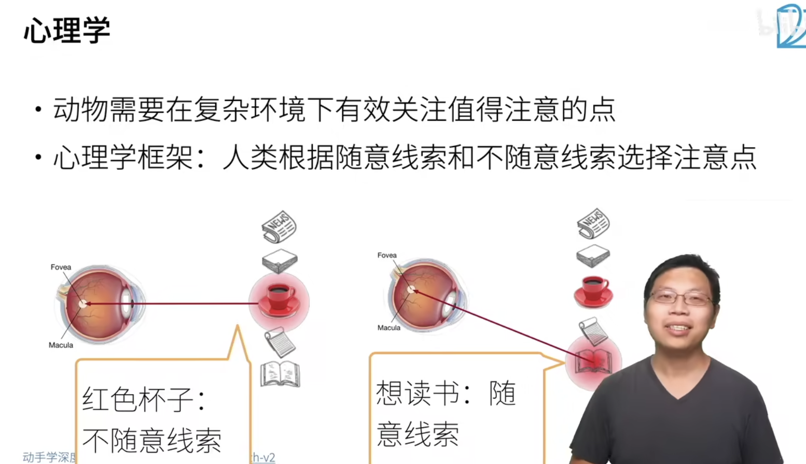
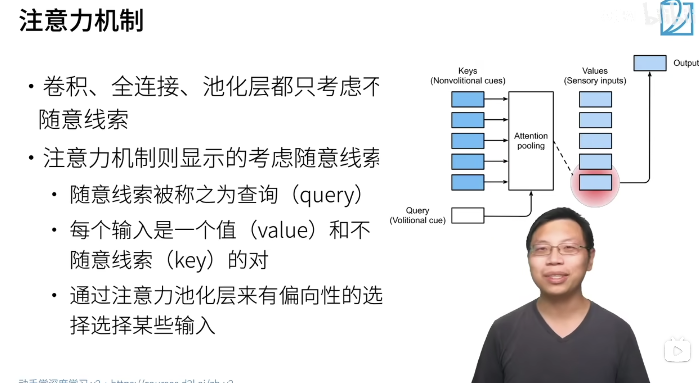
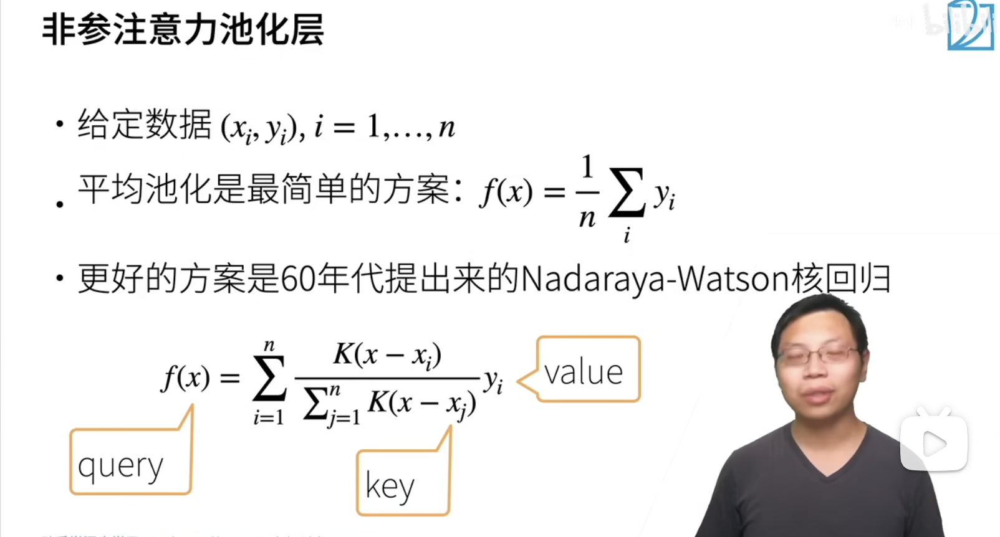
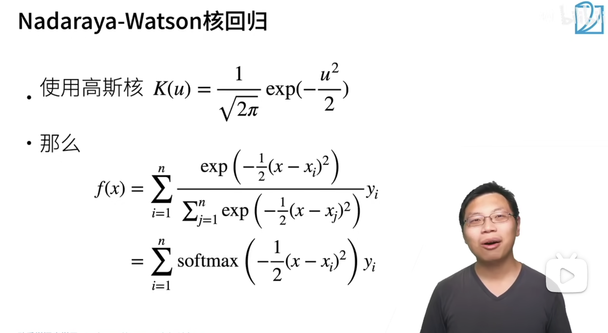
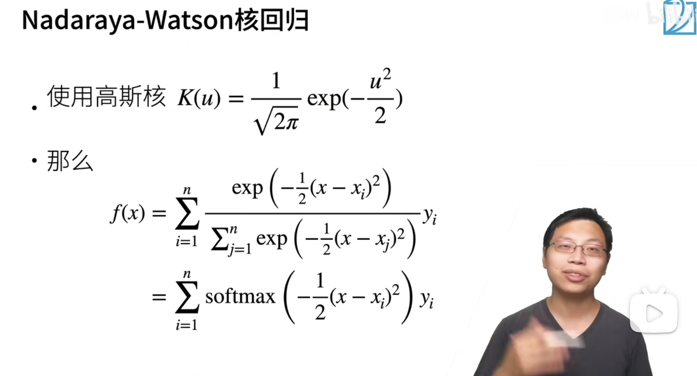
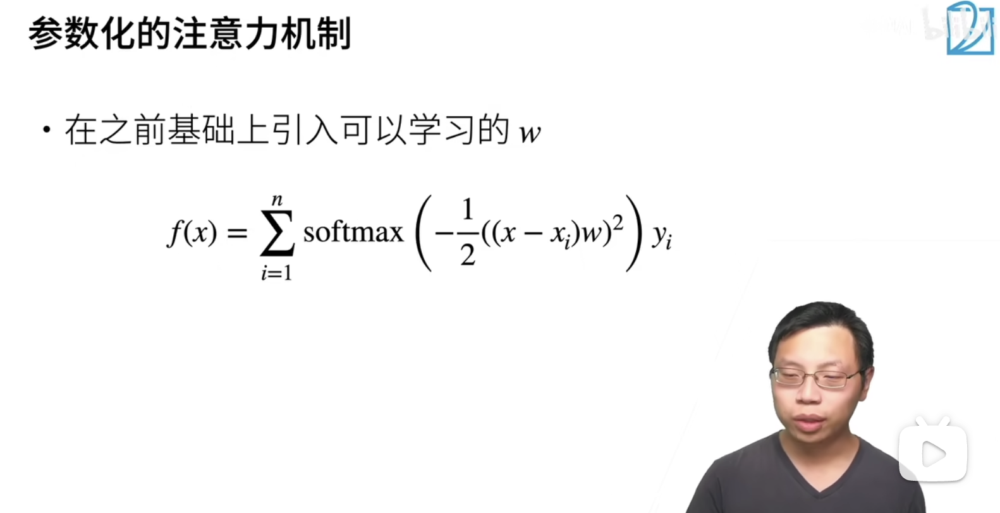
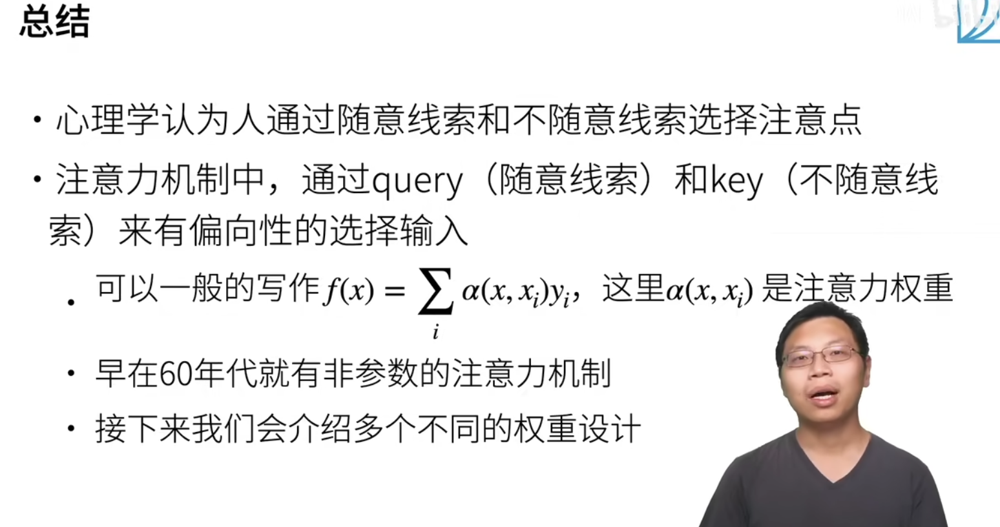

## 心理学启发

1. 不随意线索：不随着自己的主观意识去发出的动作
2. 随意线索：随着自己的主观意识发出的动作

## 注意力机制

## 非参注意力池化层

1. 非参：不用学习参数，只需要给定数据对 $ (x_i, y_i) $  就可以给出结果，其中 $ x_i $ 是 $ key $ 而 $ y_i $ 是对应的 $ value $
2. 平均池化层：不管给定的 $ x $ 是什么，每次都返回所有数据的平均值
3. 对于更好地方案：其中 $ K $ 是一个核，$ K(x-x_i) $ 像是衡量了 $x$ 和 $x_i$ 之间的距离，让它们减一下，再让分子除以下边的分母，这样就变成了一个概率，计算出来的每一项概率再用 $y_i$ 对它加权

## Nadaraya-Watson 核回归

## 函数 K - 核的选择

## 参数化的注意力机制

加入可以被训练和学习的权重 $w$ 就叫做参数化的注意力机制了，在这里的 $w$ 是一个标量

## 总结

代码还没写！

