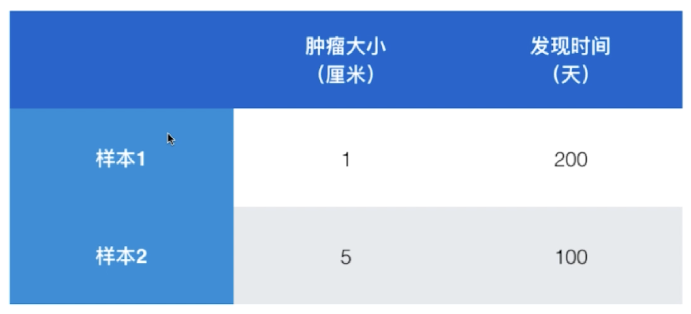
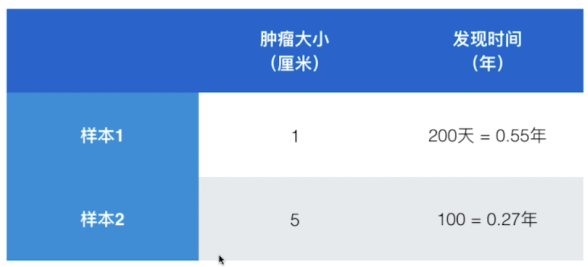
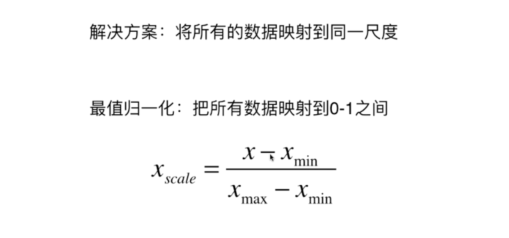
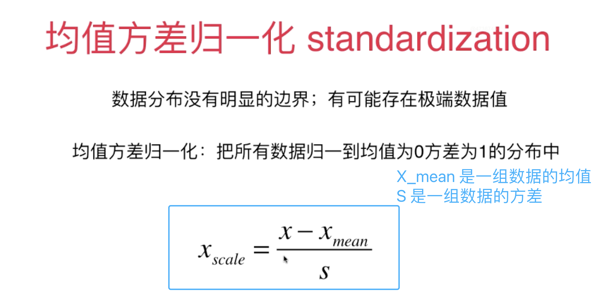

## 数据归一化

肿瘤大小和发现时间在数值的大小上有太大的差距

在 KNN 算法中，预测结果可能被发现时间所主导了，结果就是发现的时间天数有了比较大的主导地位

若使用年作为单位，那么肿瘤大小就成为了主导地位的特征

数据归一化：  （最值归一化 normalization）

使用情况：适用于分布有明显边界的情况；受 outlier 影响较大

比如大多数人的收入是 1 万，而有一个人的收入是 100 万，因此大多数人的收入将会被归一化到 0.01 这个位置。

对于上述问题的改进方案是：均值方差归一化（standardization）

均值方差归一化：把所有数据归一化到均值为 0 方差为 1 的分布中

使用情况：数据分布没有明显边界；有可能存在极端的数据值

 

