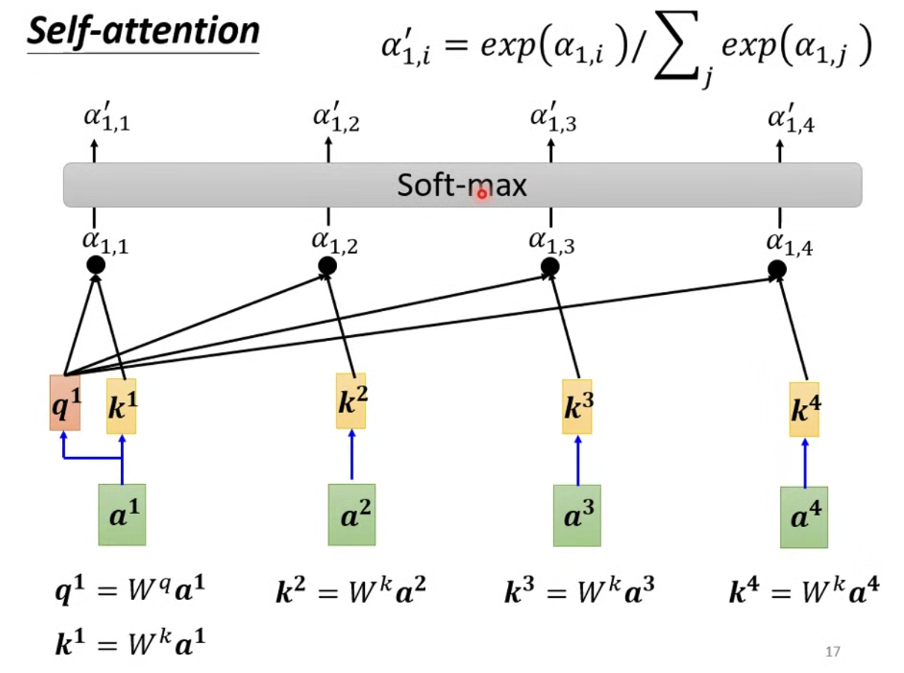

## Self-Attention

李宏毅老师的自注意力机制理论讲解

给定的输入是一个向量，经过自注意力机制的转换后输出的也是一个向量。

## 叠加多层 Self Attention

## Self Attention 的输入

每一个输出 $b^{i}$ 都是首先着重考虑了$a^{i}$然后综合考虑了剩余的 $a^{i}$ 而产生的。

## 计算过程

**两个向量的相关程度衡量指标**

**方法一：Dot-Product**

**方法二：Additive**

**Dot-Product**

$\alpha$ 的专业名词叫做注意力分数（Attention Score）

$\alpha^{`}$ 是注意力分数经过归一化后的值

**query** ：输入向量与 $W^{q}$ 做运算后的结果

**key**：输入向量和 $W^{k}$ 做运算后的结果

**value** 输入向量和 $W^{v}$ 做运算后的结果，在上述图中没有得到体现

$\alpha$：$query$向量和$key$向量做点积运算后的结果

**根据得分抽取信息**

**value** 输入向量和 $W^{v}$ 做运算后的结果

$b_{j}$ ：各个得分与之对应的向量$v^{i}$做数量和向量的乘法运算后得到的各个向量相加的结果

在计算向量 $b$ 的时候，要与自己的输入向量所产生的向量 $q$ 做匹配并且得到得分后还要与自己对应的输入向量产生的向量 $v$ 做运算。这是为了将更多的注意力放在自身，与此同时还要分出一些注意力去观察周围，最后还要观察一下更远的那些向量，并对它们抽取信息。

**Note** 各个输出向量的计算可以实现并行计算

$b_{2}$ 的计算过程

## Self Attention 向量化

**Q K V 的产生**

**计算注意力分数**

**批量化计算注意力分数并归一化**

下图中不是 $\alpha^{hat}$ 而是一撇

并且在矩阵乘法运算中 矩阵 $V$ 乘一列得到的是矩阵 $V$ 中每一个列向量加权后的和，因此通过 $VA^{`}$ 可以计算出各个向量 $b^{i}$

## 多头注意力机制

自注意力机制的升级版

相关性的定义是有很多种的，在自注意力机制那里计算相关性使用的只是诸多种相关性计算的其中一种计算方法。

多头注意力机制就是要在每个自注意力机制中使用不同的相关性计算方法。这样每个自注意力机制关注到的点是不一样的。

有几种不同的相关性，就使用几个自注意力机制。

1. 生成 q 向量的时候，使用多个矩阵生成多种 q
2. k 和 v 向量同理

在计算输出向量的时候，每个自注意力机制单独计算

**格式化输出向量**

使用全连接层压缩输出向量，汇总多个自注意力机制的输出结果到一个指定长度的向量

## 位置信息

当前在自注意力机制中没有位置信息。这样的设计可能会存在一些问题，而位置信息在有些时候是比较重要的。比如，在自然语言处理中，同一个单词在不同的位置可能是呈现出了不同的词性。因此可以通过 `Positional Encoding` 的技术来表示位置的信息。

在右边这张图片中的每一列都代表一个位置向量。这是在自注意力机制论文中所使用的位置向量编码方式。这个 `vector` 是人设置的，所以会存在一些问题。使用了 `sin` 和 `cos` 。

当前的 位置编码 方式仍然是一个尚待研究的方式，甚至这个编码方式是可以通过数据学习出来的。

**应用**

只需要把位置向量 $e^{i}$和输入向量 $a^{i}$ 相加就可以了。这样操作后就相当于让每一个输入向量都带上了位置信息。

比如一篇论文中的位置信息编码方式，是这样的。

Self-Attention 在 NLP 的应用十分广泛

## 语音处理

在做语音处理的时候，由于一段语音需要使用大量的向量才能够表示，这会造成自注意力机制使用大量的计算资源并且位置向量也需要大量的存储空间。

因此，产生了一个新的技术（Truncated Self-Attention）用于解决这个问题，只看语音中的一小段，这一小段的时间长度是认为设置的。

## 图像处理

每一个像素可以看成是一个长度为 3 的向量。

Self-Attention 和 CNN 之间的差异

CNN 可以看作是一个简化版的自注意力机制，考虑滑动窗口内的内容

Self-Attention 是一个复杂化的 CNN，考虑整张图片，相当于 CNN 的滑动窗口不再是人工划定而是让机器自动学习出来。不仅仅是类比在这一点的不同，滑动窗口无论怎么改变也无法考虑整张图片，而自注意力机制可以。

 一篇阐述了 Self-Attention 和 CNN 之间差异的论文

这篇论文使用数学严谨的阐述了 CNN 是 Self-Attention 的特例

 

Google 的一篇文章阐述了随着数据集大小的变化，Self-Attention 和 CNN 训练模型后的变化趋势。

横轴代表资料量的数量大小，1M = 1百万

1. 数据量较少的时候，CNN 的效果好于 Self-Attention，这是因为 CNN 受到的限制比较多，对于小量的数据集而言能够有更好的泛化效果。
2. 随着数据集的增大，Self-Attention 的效果好于 CNN，这是因为随着数据集增大，Self-Attention 的过拟合逐渐被修正了。

Self-Attention 的弹性较大，需要较大的数据集

CNN 受到的限制较多，弹性较小，在数据集较小的时候可以有更好的泛化效果

## RNN 和 Self-Attention

双向循环神经网络 bidirection-rnn 可以同时考虑上下文，这和 Self-Attention 的作用非常相似。

但是 bidirection-rnn 不能够并行计算，而 Self-Attention 可以并行计算并产生输出向量。

有关这两者之间的关系，可以看这篇文章

## Self-Attention for Graph

自注意力机制用在图上

1. 节点的信息（可以通过向量表示）
2. 边的信息（表示哪些节点向量之间的关联性计算是有意义的，减小了算法的计算量）

**Attention-Matrix** 反映了节点和节点之间是否相互连接

那么在通过 Self-Attention 计算关联性强弱的时候，可以只计算这些在通过边相互连接的这些节点（向量表示节点）的关联性并产出结果向量，没有关系的那些节点的关联性可以直接设置为0即可。

1. 只计算边相互连接的这些向量之间的关联性减少了计算的复杂度（从稠密图变为了稀疏图）
2. 若不论是否有关联都进行计算的话，那么这是在稠密图上进行计算（算法的复杂度高）

## 有关更多 Self-Attention 变形的文章

上图中，纵轴代表模型的得分，横轴代表计算速度，说明了不同的 Self-Attention 变形而来的模型，在这两方面的综合考虑

transformer 是变形的意思

提出了一个新的模型叫做 transformer，这是因为这个模型是 Self-Attention 的一种变形

而关于更多 Self-Attention 变形而来的模型，很多都叫做 xxx-former，因为这些都是来自 Self-Attention 的变形

那么，到底一个什么样子的变形是又快又好的，这仍然是一个尚待研究的问题

