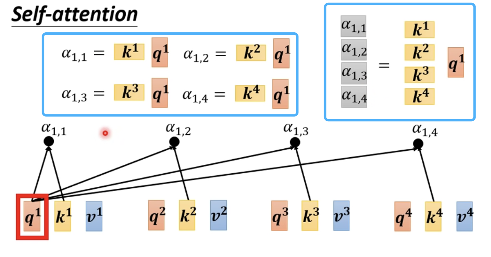
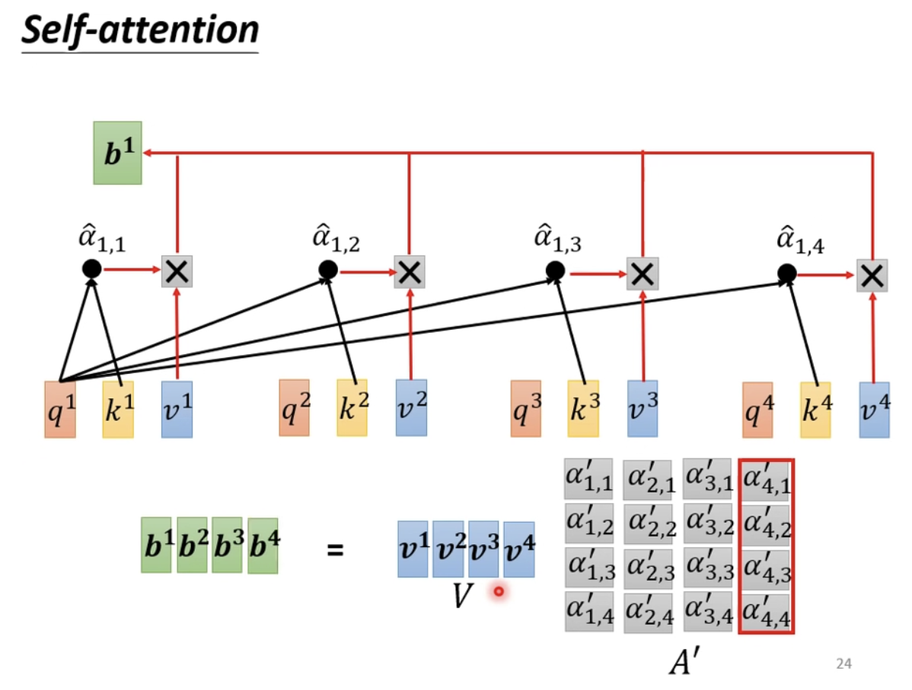

## Self-Attention

李宏毅老师的自注意力机制理论讲解

给定的输入是一个向量，经过自注意力机制的转换后输出的也是一个向量。

## 叠加多层 Self Attention

## Self Attention 的输入

每一个输出 $b^{i}$ 都是首先着重考虑了$a^{i}$然后综合考虑了剩余的 $a^{i}$ 而产生的。

## 计算过程

**两个向量的相关程度衡量指标**

**方法一：Dot-Product**

**方法二：Additive**

**Dot-Product**

$\alpha$ 的专业名词叫做注意力分数（Attention Score）

$\alpha^{`}$ 是注意力分数经过归一化后的值

**query** ：输入向量与 $W^{q}$ 做运算后的结果

**key**：输入向量和 $W^{k}$ 做运算后的结果

**value** 输入向量和 $W^{v}$ 做运算后的结果，在上述图中没有得到体现

$\alpha$：$query$向量和$key$向量做点积运算后的结果

**根据得分抽取信息**

**value** 输入向量和 $W^{v}$ 做运算后的结果

$b_{j}$ ：各个得分与之对应的向量$v^{i}$做数量和向量的乘法运算后得到的各个向量相加的结果

在计算向量 $b$ 的时候，要与自己的输入向量所产生的向量 $q$ 做匹配并且得到得分后还要与自己对应的输入向量产生的向量 $v$ 做运算。这是为了将更多的注意力放在自身，与此同时还要分出一些注意力去观察周围，最后还要观察一下更远的那些向量，并对它们抽取信息。

**Note** 各个输出向量的计算可以实现并行计算

$b_{2}$ 的计算过程

## Self Attention 向量化

**Q K V 的产生**

**计算注意力分数**

**批量化计算注意力分数并归一化**

下图中不是 $\alpha^{hat}$ 而是一撇

并且在矩阵乘法运算中 矩阵 $V$ 乘一列得到的是矩阵 $V$ 中每一个列向量加权后的和，因此通过 $VA^{`}$ 可以计算出各个向量 $b^{i}$

15分15秒