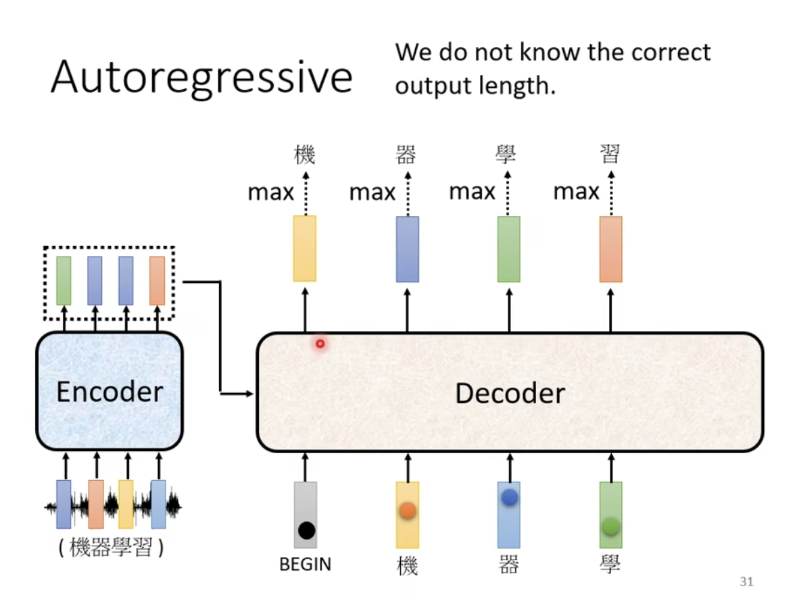
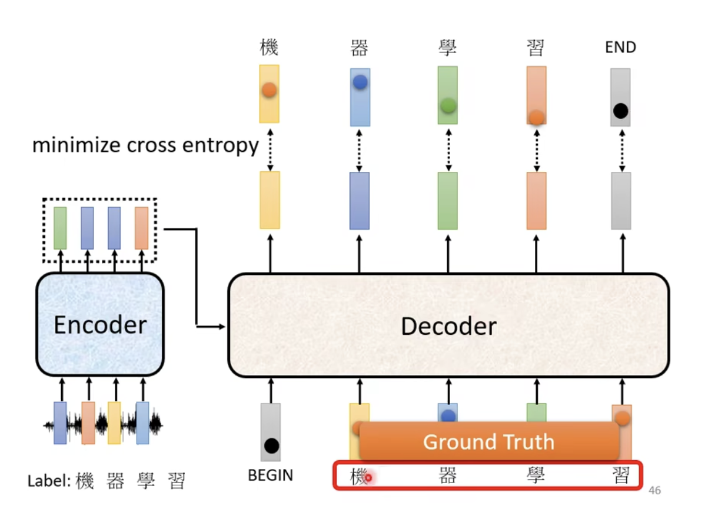

李宏毅老师讲的 Transformer

Transformer 是一个 seq2seq 的 model

  

## 聊天机器人

聊天机器人也是 seq2seq 的应用

训练的数据集就是聊天对话

机器翻译也是 QA 的问题，扔给模型一个语言的句子，输出另外一种语言的文字。问题是：输出的句子对应的另一种语言的句子是什么。

各式各样的 NLP 的任务，很多都可以使用 seq2seq

专用的问题使用专用的模型，这可以得到更好的答案。

## 多标签分类

## 目标检测

## Transformer 架构

**Encoder**

**简化版的 Transformer Block**

**Transformer Block**

真正的 Transformer 中增加了一个设计，我觉得把这个称为短路非常合适呢 ~

这种架构称之为 **residual connection** 中文名叫做 残差网络，这是为了能够让网络做的更深，如果中间加的某个模型没有学习到任何内容，那就把这个模型给短路掉，至少包含了一个更小的子模型的内容，不会让模型越做越偏，越训练越偏，越学习越偏地更厉害。

经过 residual 后再做一下 norm (归一化)，在这里使用的是 Layer Norm

1. Batch Norm
2. Layer Norm

  

**Block 之前要 Positional Encoding**

另外一篇文章对 Encoder 的设计，是这样的：

**Decoder**

Decoder 的输入有两部分

1. Encoder 的输出
2. Decoder 的输入

在训练的过程中，每次使用正确的输入作为 Decoder 的输入，因为预测出来的值可能是错误的，这样可能会导入一步错，步步错

架构图

遮挡一部分后，其实 Decoder 和 Encoder 的区别并不是特别大

在 Decoder 的注意力机制部分加了一个 Masked，变成了 Masked-Multi-Head-Attention

在产生一个输出的时候，只能看到这个输出之前的信息，这就是 Masked 的作用

更具体的是这样的：

**当前存在的问题**

当前存在的问题是，模型不知道什么时候才应该停下来，会一直向下推理

这时候希望这个模型在一个时刻预测出一个结束的标志，来解决这个问题

准备一个特殊的符号作为结束标志

两种 Decoder 的思路

了解更多关于 NAT 的内容

在 Encoder 和 Decoder 之间如何传递信息

传递信息的细节：

Encoder 的输出作为右侧桥梁的 Multi-Head-Self-Attention 的 key value，而 Masked-Attention 的输出作为 query ，这里产生的输出作为下一层 Add & Norm 的输入

右侧桥梁 Multi-Head-Self-Attention 完成的任务就是从源句子抽取和当前需要转换的序列的相关信息

在后边的 Feed-Forward 的作用才是做对于这个集成了源句子有关的信息以及当前的输入序列的内容进行预测判断。我认为 Feed-Forward 复杂度比较低，因为之前的工作全部都是在想尽一切的方法来抽取相关的信息，能够更好的注意到有用的数据而已。所以真正用来做预测的这部分的模型复杂度还是比较低的，因此可以在 PPT 中看到有一个 $×N$ 这样一个符号，就是为了进一步增加模型的复杂度。

假设之前的信息抽取已经做的非常好了，那么在这里叠加更多层的时候，能否只叠加预测部分的复杂度，而不再去进行信息的抽取呢？相比而言，Self-Attention 的训练代价非常大的，获取这部分训练的代价，并没有为模型提供更多的贡献。或许真正有贡献的部分只是用来预测的那一部分。

这样的优化思路，能否让效果不太差，而且计算复杂度有所下降呢？

Decoder 每一次必须拿 Encoder 最后一层的输出吗

这篇文章探索了不同的连接方式

**Transformer Training**

使用交叉熵损失

在训练的时候，要让 Decoder 的输入是正确答案

Teacher Forcing：using the ground truth as input

强制学习：使用正确的答案作为输入

## 复制操作

聊天机器人，在有些情况不需要创造一些词汇出来，而是复制输入的内容作为输出

摘要：让模型读一篇文章，然后产出摘要。这种模型的训练通常需要百万篇文章

最早可以复制输入作为输出的模型：

## 语音合成

第一个到第三个的音频输出效果还不错，但是第四个的音频输出效果不太好

第一个竟然训练出来了抑扬顿挫的感觉

第四个缺只有发财的财被念了出来，而发却几乎没有声音

对于训练过程中，机器漏掉了一段内容，这样的问题的解决方案如下：

**Guided Attention**

引导机器的注意力机制为从左到右

**Beam Search**

束搜索，这个技术在李沐老师的课程里边有讲到

区别在于，贪心搜索（局部最优）和全局搜索（全局最优），但是一般做不到全局最优，但是可以通过束搜索找到次优解。

这个技术有时候有用，有时候没用

有一篇文章说，这个技术是一个很烂的东西

有时候找到分数最高的路径，效果是最好的；有时候找到分数最高的路，效果是不好的

有时候在预测的时候加入一个噪音（随机性）反而会有更好的效果，比如 TTS

从量子力学来看，这个世界就是随机的呀，所以要加入一定的随机性，反而会有了更好的效果。

未来也是随机的呀 ~ 

让交叉熵损失最小，不一定能够让 BLEU score 的值更小

在训练的时候不能够使用 BLEU score 作为损失函数（因为BLEU不能够微分）

一种方法是，训练出来了多个模型，从中挑选 BLEU 最高的那个模型，BLEU 可以在训练后进行评估

在训练的时候 Decoder 看到的都是正确的信息，而测试的时候 Decoder 使用上一次的输出作为下一次的输入，那么这个问题该如何解决？有这样的一个思考

这个思考就是在训练的时候给 Decoder 的输入加入一些错误的信息，引入噪音，引入随机性

这个方式会伤害到 Self-Attention 的平行化能力（应该是说并发能力吧）

