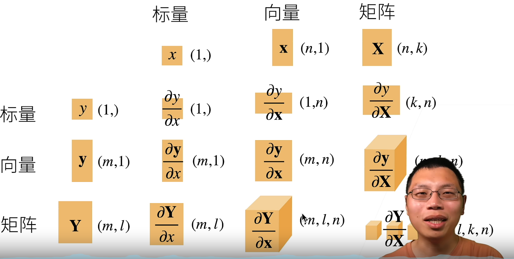

# Metrics-Computing

矩阵的求导计算：

就是用分子的每一个分量对分母中的每一个分量依次求导，最后用向量或矩阵的形式表示出来：

按分子布局：就是最终求导的结果矩阵中，每一列中的分子都是一个完整的原分子上边的向量。

分子布局 ==> 结果中原分子是列向量，分母是行向量

分母布局 ==> 与上边正好相反

但总要有一个是列向量，另一个是行向量

推荐一下知乎的博主Iterator写的关于矩阵求导的布局和推导的文章。我也是恰好在这个视频前一个月看过，对这个视频会接受起来比较容易。
矩阵求导的本质与分子布局、分母布局的本质（矩阵求导——本质篇）：https://zhuanlan.zhihu.com/p/263777564
矩阵求导公式的数学推导（矩阵求导——基础篇）：https://zhuanlan.zhihu.com/p/273729929
矩阵求导公式的数学推导（矩阵求导——进阶篇）：https://zhuanlan.zhihu.com/p/288541909