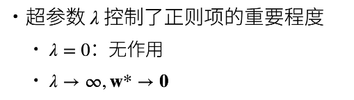
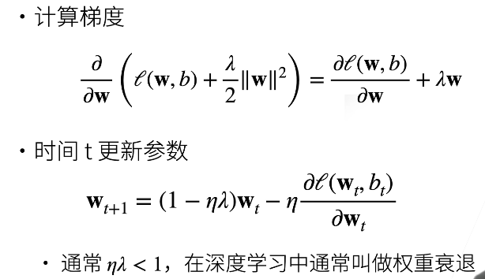

# Weight Decay

权重衰退

## 使用均方范数作为硬性限制

式子中的 min 代表寻找后边的式子的最小值

1. 通过限制参数值的选择范围来控制模型容量
2. 通常不对 偏移量b 进行限制（限不限制都差不多）
3. 小的 theta 意味着更强的正则项
4. 向量 w 中的每一个分量的平方都是小于 theta 的

$$
min \space l(\symbfit{w}, b) \space subject \space to \space ||w||^{2} \le \theta
$$

对于每个 theta，都可以找到 lambda 使得之前的目标函数等价于下面的式子：

可以通过拉格朗日乘子来证明

在原始的损失函数上边加上一项，通常称呼被加上的这一项为惩罚
$$
min \space l(\symbfit{w}, b) + \frac{\lambda}{2}||w||^{2}
$$

惩罚是柔性限制 ：惩罚的引入，使得最优解靠近了原点，记住：这个是等高线，而不是普通的圆，其中黄色的等高线是惩罚的，另外的绿色等高线是原本的损失函数的。在两者的交界点达到了平衡，这样使得最优解靠近圆点，在一定程度上缓解了过拟合的问题。

## 参数更新法则

为什么叫权重衰退？

其中 eta 是学习率，另外的 lamda 是惩罚项的超参数，之所以叫权重参数，是因为在从权重 Wt 更新到参数 Wt+1 的时候首先把 Wt 给缩小的一下然后才去更新的，其中的 eta*lamda 是一个小于 1 的正常熟，这两个都是超参数都是在算法运行前就指定了的。

## 总结

- 权重衰退通过 L2 正则项使得模型参数不会过大，从而控制模型复杂度
- 正则项权重是控制模型复杂度的超参数