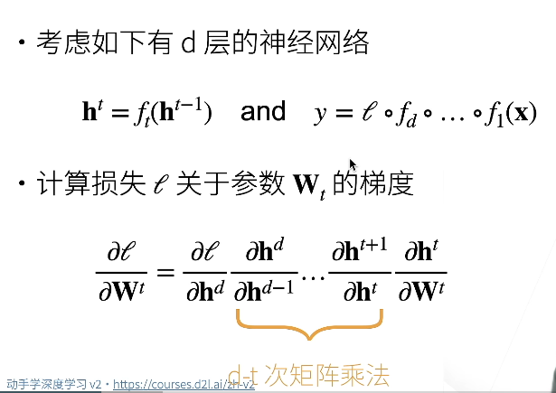
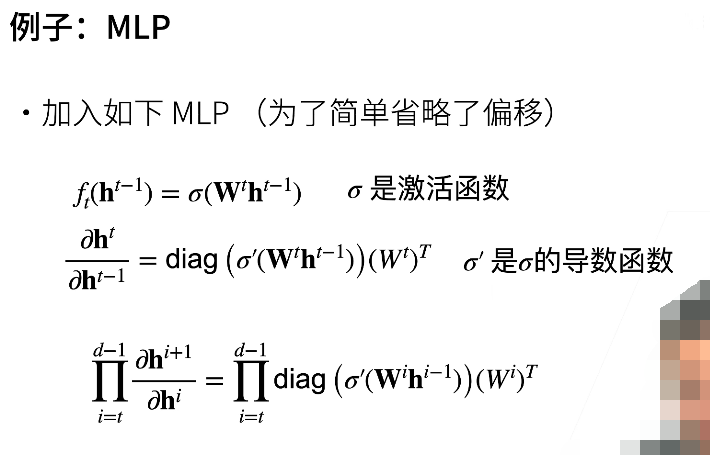
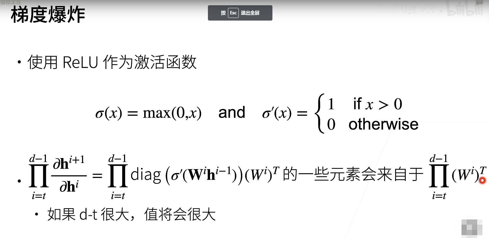
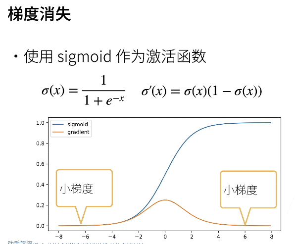
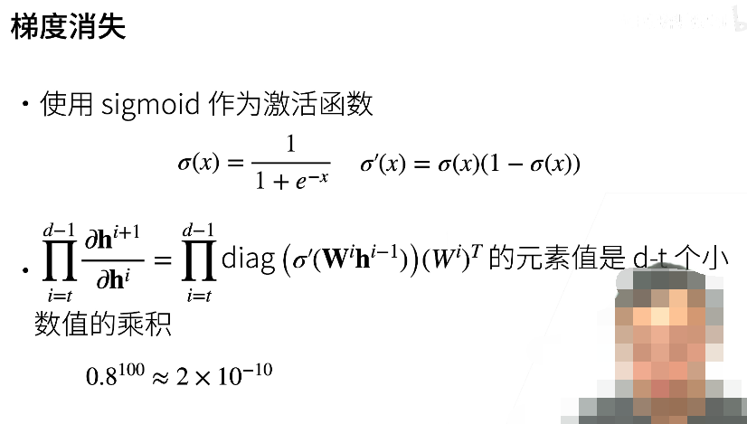

# 神经网络的梯度

1. ht 对 ht-1 求导，这样并不是为了更新当前层的 W 权重矩阵，而是为了更新更加往前一些层的 W 矩阵，因为当前层的输入 ht-1 的数据是来自于更往前的一些层的 W 矩阵的作用之下。
2. 把 h 看成是向量，那么说明现在考虑的是输入数据仅为 1 个样本的情况，如果是多个样本的话，那么 h 也是一个矩阵。
3. 可以确定的是 对 Wt 矩阵求导的时候，前边的那些权重矩阵都会以一种系数的形式蕴含在整个式子中，也就称这些权重矩阵被反向传递了，如此一来的大量矩阵乘法就会导致梯度爆炸或者梯度消失。至于为什么权重矩阵会蕴含在这个式子中可以这样理解，当我们对 hd 向量求导的时候，这时候 d 层的权重矩阵是当作常量来看待的（按照多元函数求偏导数的规则：对谁求导才把谁当作变量）。所以 d 层的权重矩阵会当作对 hd 向量求导后的那个常数矩阵。就像对 y = wx^2 求导，这时候 w 被保留下来了，y' = 2wx，这个 w 被当作了一个系数，这个时候 x 再向更前边的网络层求导，那么这个 w 最终会被乘在这个链式法则上边。

问题在于 ==> 向量对向量求导的结果是一个矩阵 ==> 做了太多的矩阵乘法

带来的两个问题：（假设有 100 层网络）

1. 梯度爆炸：若梯度是 1.5 那么 1.5 的 100 次方约等于 4 × 10 的 17 次方
2. 梯度消失：若梯度是 0.8 那么 1.5 的 100 次方约等于 2 × 10 的 -10 次方

因为计算机的浮点数是有范围的

## 梯度爆炸

diag 表示对角矩阵：在 MLP 的情况下会产生梯度爆炸

MLP ==> 多层感知机模型

公式的第 2 行，若 h 为向量，那么其中 Wt.dot(ht-1) 是一个向量，同时 sigma' 的输出也为一个向量，diag 则是把向量做成对角矩阵，如果用行向量点乘一个矩阵的结果为一个向量 ==> 作用在不同的行之后把他们加了起来压缩成了一个向量。如果把行向量做成对角矩阵，那么仅仅是使用对角上边的分量作用在了各个行上，并不会把这些行压缩成一个向量。

如果激活函数使用 ReLU：

那么导数只能是 0 或者 1 了 ~ 但是如果 W 矩阵中都是正值，那么最后乘起来就会出现非常大的值，导致梯度爆炸

## 梯度爆炸产生的问题

1. 数值超过界限
2. 梯度爆炸的话，那么对学习率会非常敏感，一个很小的学习率就会更新非常大的步伐

## 梯度消失

- 使用 sigmoid 作为激活函数

1. 当输入的值大的时候，梯度会非常小
2. 当输入的值小的时候，梯度也会非常小

## 梯度消失产生的问题

当网络的层数比较深的时候，对于越接近样本数据输入的层就越难以更新难以训练，那么这样就无法让底层的那些层有好的训练，这样就失去了对于深度的神经网络的意义。

## 总结

- 当数值过大或者数值过小时会导致数值问题
- 常发生在深度模型中，因为其会对 n 个数累乘