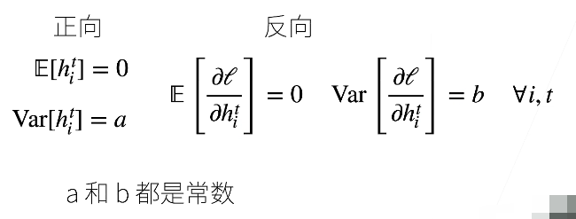
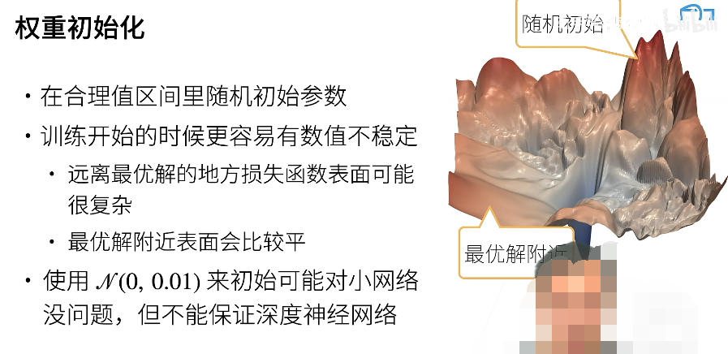
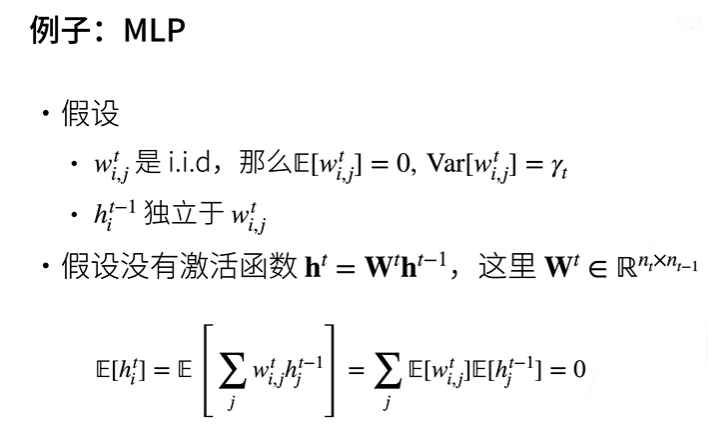
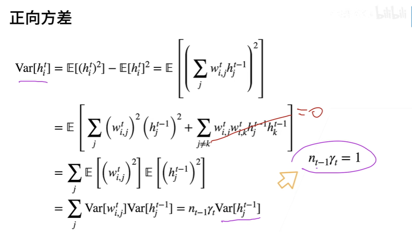
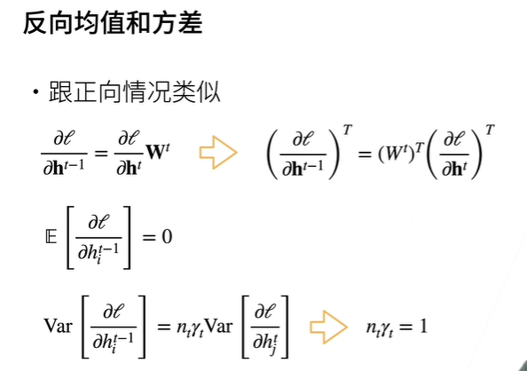

数值稳定性 + 模型初始化和激活函数

# 让训练更加稳定

1. 目标：让梯度值在合理的范围内，例如 [1e-6, 1e3]
2. 乘法变加法：ResNet，LSTM
3. 归一化：梯度归一化： 把梯度拉回来，梯度剪裁：强行把梯度变回来
4. 合理的权重初始化和使用合理的激活函数（本节重点）

方法：（希望设计出的神经网络满足下边的性质）

1. 将每层的输出和梯度都看作随机变量
2. 让它们的均值和方差都保持一致

正向传播的时候，让第 t 层的输出的第 i 个分量的均值为 0 方差为 a

反向传播的时候，让第 t 层的权重的第 i 个分量的均值为 0 方差为 b

## 权重初始化

## 正向传播均值和方差

例子：MLP

1. 对于均值：

注意：第 t-1 层的输出的第 i 个分量 hi 是第 t 层的输入

hti 就等于上一层的输入和这一层的权重的点积，只不过在式子中写成了求和符号的样子，因为 w 和 h 是独立的，所以乘积的均值可以写成均值的乘积

2. 对于方差

独立同分布的均值等于 0 

方差 = 平方的均值 - 均值的平方

当均值为 0 的时候，均值的平方为 0，则方差 = 平方的均值
下列式子中，就有用到这个特点

nt-1 是上一次的神经元节点的个数，也就是这一层的每个神经元节点的输入的值的个数，其中 j 代表了这一层的第 i 个神经元节点的第 j 个分量，也就是权重矩阵中第 i 行 j 列的 wij

另外的 γt 是在上图中已经假设的：

 

## 反向均值和方差

看到了 14：50 的位置
